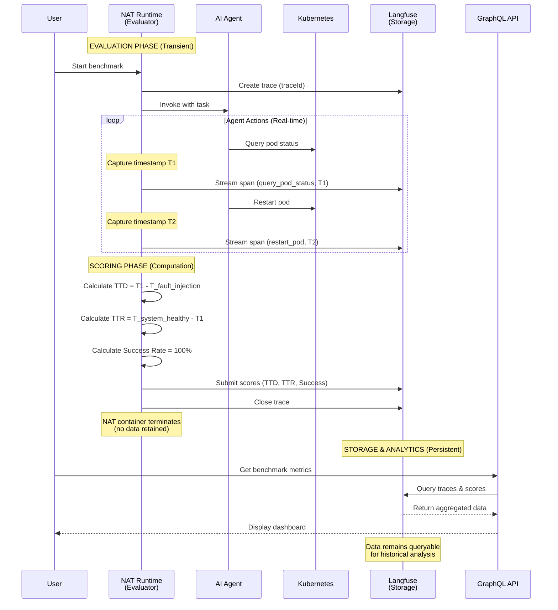

# AI Agent Benchmarking - Architecture Specification

## 1. Architecture Overview

The AI Agent Benchmarking feature extends the LitmusChaos platform to provide a comprehensive framework for evaluating AI agents in fault-injected Kubernetes environments. This architecture leverages the existing Chaos Control Plane (ChaosCenter) and Chaos Execution Plane infrastructure while introducing minimal new components focused on AI agent registration and evaluation orchestration.

**Standard Evaluation Framework**: The architecture integrates **NVIDIA NeMo Agent Toolkit (NAT)** as the standard benchmarking and monitoring framework for evaluating AI agent performance. NAT provides production-ready agent evaluation capabilities with built-in monitoring, metrics collection, scoring, and observability features specifically designed for AI agent workflows.

**Agent Observability Platform**: The architecture uses **Langfuse** as the dedicated observability and data storage platform for AI agent traces, runs, and evaluation metrics. Langfuse provides comprehensive LLM application tracking, cost monitoring, and performance analytics without requiring custom database infrastructure.

The solution follows LitmusChaos's established domain-driven architecture pattern, reusing existing experiment orchestration infrastructure (ChaosExperiment, ChaosEngine, Argo Workflows) and enhancing it with AI agent registration capabilities. The architecture supports both self-hosted and SaaS deployment models, maintains Docker containerization standards, and ensures seamless integration with existing chaos engineering workflows.

**Key Architectural Principles:**
- **Minimal Disruption**: Build on existing ChaosExperiment, ChaosEngine, and ChaosResult patterns
- **Reuse Existing Infrastructure**: Leverage existing experiment orchestration instead of creating parallel systems
- **Standards-Based Evaluation**: Use industry-standard tools (NAT for evaluation, Langfuse for observability)
- **Agent Isolation**: Ensure AI agent execution does not interfere with core chaos operations
- **Observable by Design**: Comprehensive agent tracking via Langfuse, experiment monitoring via existing infrastructure
- **Security First**: RBAC, audit logging, and sandboxed agent execution environments

## 2. System Architecture Diagram

```mermaid
graph TB
    subgraph Legend["📊 LEGEND"]
        E["🟢 [E] Existing"]
        N["🔴 [N] New/To Be Implemented"]
        M["🟡 [M] To Be Modified/Enhanced"]
        X["🔵 [X] External Systems"]
    end
    
    subgraph "User Layer"
        WebUI["[M] Web UI - React/TypeScript"]
        CLI["[M] LitmusCtl CLI"]
        AIDevSDK["[N] AI Agent Developer SDK"]
    end

    subgraph "Chaos Control Plane - ChaosCenter"
        subgraph "Application Services"
            LB["[E] Load Balancer/Ingress"]
            GraphQL["[M] GraphQL Server - gqlgen"]
            Auth["[E] Authentication Service - gRPC"]
            EventTracker["[E] Event Tracker Service"]
        end

        subgraph "AI Agent Benchmarking Extensions"
            AgentRegistry["[N] Agent Registry<br/>(pkg/agent_registry/)<br/>Go package in graphql/server"]
            BenchmarkProject["[N] Benchmark Project<br/>(pkg/benchmark_project/)<br/>Go package in graphql/server"]
        end

        subgraph "Existing Chaos Services (REUSED)"
            ExpHandler["[M] Chaos Experiment Handler<br/>(Enhanced for AI Agent Scenarios)"]
            RunHandler["[E] Chaos Experiment Run Handler"]
            InfraService["[E] Chaos Infrastructure Service"]
            ProbeService["[E] Probe Service"]
        end

        subgraph "Data Layer"
            MongoDB["[M] MongoDB<br/>(Chaos Experiments + Agent Registry)"]
        end

        subgraph "Message/Event Layer"
            EventBus["[E] WebSocket Event Bus"]
        end
    end

    subgraph "Chaos Execution Plane - Target Cluster"
        Subscriber["[M] Chaos Subscriber Agent<br/>(Enhanced for NAT Integration)"]
        
        subgraph "NAT Evaluation Environment"
            NATRuntime["[N] NAT Runtime Container<br/>(NeMo Agent Toolkit)"]
            NATEvaluator["[N] NAT Evaluator<br/>(Task-Agent-Evaluator Model)"]
        end
        
        subgraph "AI Agents Under Test"
            AIAgent1["[N] AI Agent 1"]
            AIAgent2["[N] AI Agent 2"]
            AIAgentN["[N] AI Agent N"]
        end

        subgraph "Kubernetes Resources"
            ArgoWorkflow["[M] Argo Workflow CR<br/>(NAT-Enhanced Templates)"]
            ChaosEngine["[E] ChaosEngine CR"]
            ChaosExperiment["[M] ChaosExperiment CR<br/>(AI Agent Benchmarks)"]
            ChaosResult["[E] ChaosResult CR"]
            Pods["[E] Application Pods"]
        end

        subgraph "Monitoring & Observability"
            Prometheus["[E] Prometheus"]
            ChaosExporter["[E] Chaos Exporter"]
            K8sAPI["[E] Kubernetes API"]
        end
    end

    subgraph "External Integrations"
        Langfuse["[X] Langfuse<br/>(Agent Observability Platform)<br/>- Trace Storage<br/>- Metrics & Scoring<br/>- Agent Analytics"]
        GitOps["[X] GitOps - Dex/OAuth"]
        ChaosHub["[X] ChaosHub - Experiment Templates"]
    end

    %% User interactions - EXISTING & NEW
    WebUI -->|"[E] HTTPS/GraphQL"| LB
    CLI -->|"[E] HTTPS/GraphQL"| LB
    AIDevSDK -->|"[N] GraphQL API"| GraphQL

    %% Load balancer routing - EXISTING
    LB -->|"[E] Route GraphQL"| GraphQL
    LB -->|"[E] Route Auth"| Auth

    %% GraphQL resolver delegations - MODIFIED (new service modules in GraphQL server)
    GraphQL -->|"[N] Agent Mutations/Queries"| AgentRegistry
    GraphQL -->|"[N] Benchmark Mutations/Queries"| BenchmarkProject
    GraphQL -->|"[M] Experiment Mutations/Queries"| ExpHandler
    GraphQL -->|"[E] Run Mutations/Queries"| RunHandler
    GraphQL -->|"[E] Infra Mutations/Queries"| InfraService
    GraphQL -->|"[E] Probe Mutations/Queries"| ProbeService

    %% Service authentication - EXISTING
    GraphQL -->|"[E] gRPC Auth"| Auth
    Auth -->|"[E] Store Users"| MongoDB

    %% Agent Registry - NEW (Go package in graphql/server)
    AgentRegistry -->|"[N] Store Agents"| MongoDB
    AgentRegistry -->|"[N] Sync Agent Metadata"| Langfuse

    %% Benchmark Project - NEW (Go package in graphql/server)
    BenchmarkProject -->|"[N] Store Projects"| MongoDB
    BenchmarkProject -->|"[N] Delegates Execution"| RunHandler

    %% Experiment execution - REUSED WITH ENHANCEMENTS
    ExpHandler -->|"[M] Store Experiments"| MongoDB
    RunHandler -->|"[E] Store Runs"| MongoDB
    RunHandler -->|"[E] WebSocket Events"| Subscriber
    Subscriber -->|"[E] Watch Workflows"| ArgoWorkflow
    Subscriber -->|"[E] Watch Results"| ChaosResult
    ArgoWorkflow -->|"[E] Creates Engine"| ChaosEngine
    ChaosEngine -->|"[E] References Template"| ChaosExperiment
    ChaosEngine -->|"[E] Injects Faults"| Pods
    ChaosEngine -->|"[E] Creates Result"| ChaosResult
    
    %% NAT Integration - NEW
    ArgoWorkflow -->|"[N] Deploys & Orchestrates"| NATRuntime
    NATRuntime -->|"[N] Loads Tasks"| NATEvaluator
    NATEvaluator -->|"[N] Invokes"| AIAgent1
    NATEvaluator -->|"[N] Invokes"| AIAgent2
    NATEvaluator -->|"[N] Invokes"| AIAgentN
    
    %% AI Agent actions - NEW
    AIAgent1 -->|"[N] Query State"| K8sAPI
    AIAgent1 -->|"[N] Remediate"| K8sAPI
    AIAgent2 -->|"[N] Query State"| K8sAPI
    AIAgent2 -->|"[N] Remediate"| K8sAPI
    AIAgentN -->|"[N] Query State"| K8sAPI
    AIAgentN -->|"[N] Remediate"| K8sAPI

    %% NAT Observability - NEW
    NATEvaluator -->|"[N] Stream Traces"| Langfuse
    AIAgent1 -.->|"[N] Optional: Agent Traces"| Langfuse
    AIAgent2 -.->|"[N] Optional: Agent Traces"| Langfuse
    AIAgentN -.->|"[N] Optional: Agent Traces"| Langfuse
    NATEvaluator -->|"[N] Metrics & Scores"| Langfuse

    %% Monitoring and metrics - EXISTING
    Subscriber -->|"[E] Stream Events"| EventBus
    EventBus -->|"[E] Track Events"| EventTracker
    ChaosExporter -->|"[E] Scrape Metrics"| Prometheus
    K8sAPI -->|"[E] Export Metrics"| Prometheus

    %% Analytics retrieval - NEW
    GraphQL -->|"[N] Query Traces/Metrics"| Langfuse
    GraphQL -->|"[E] Real-time Subscriptions"| WebUI

    %% External integrations - EXISTING
    InfraService -->|"[E] OAuth/OIDC"| GitOps
    ExpHandler -->|"[E] Fetch Templates"| ChaosHub

    %% Styling
    classDef userLayer fill:#e1f5ff,stroke:#01579b,stroke-width:2px
    classDef controlPlane fill:#f3e5f5,stroke:#4a148c,stroke-width:2px
    classDef executionPlane fill:#e8f5e9,stroke:#1b5e20,stroke-width:2px
    classDef newComponent fill:#ffebee,stroke:#c62828,stroke-width:3px
    classDef dataLayer fill:#fce4ec,stroke:#880e4f,stroke-width:2px
    classDef external fill:#e3f2fd,stroke:#1565c0,stroke-width:2px
    classDef modified fill:#fff9c4,stroke:#f57f17,stroke-width:2px
    classDef existing fill:#e8f5e9,stroke:#2e7d32,stroke-width:2px

    class WebUI,CLI,GraphQL,ExpHandler,Subscriber,MongoDB,ArgoWorkflow,ChaosExperiment modified
    class AIDevSDK,AgentRegistry,BenchmarkProject,NATRuntime,NATEvaluator,AIAgent1,AIAgent2,AIAgentN,Langfuse newComponent
    class LB,Auth,EventTracker,RunHandler,InfraService,ProbeService,EventBus,ChaosEngine,ChaosResult,Pods,Prometheus,ChaosExporter,K8sAPI existing
    class GitOps,ChaosHub external
```



### Architecture Layers Explanation

#### User Layer
The user layer provides three primary interfaces for interacting with the AI Agent Benchmarking system:
- **Web UI**: Enhanced React-based frontend with new pages for agent registration, benchmark configuration, and analytics dashboards powered by Langfuse data
- **CLI (LitmusCtl)**: Extended command-line interface for programmatic access to benchmarking features
- **AI Agent Developer SDK**: New SDK providing REST interfaces for AI agents to register with the benchmarking framework

#### Application Layer (Chaos Control Plane)
The control plane requires **NEW service layer code** following LitmusChaos's established patterns:

**NEW Service Layer Code in `chaoscenter/graphql/server/pkg/` (within existing GraphQL server):**
- **Agent Registry** (`pkg/agent_registry/`): Manages AI agent registration, configuration, lifecycle. Syncs metadata with Langfuse.

- **Benchmark Project** (`pkg/benchmark_project/`):
  GraphQL resolvers + MongoDB operators for lightweight benchmark project CRUD, delegates execution to existing ChaosExperimentRunHandler.

**Reused & Enhanced Existing Services:**
- **Chaos Experiment Handler** (MODIFIED): Enhanced to support AI agent benchmark scenarios as standard ChaosExperiments with NAT integration metadata
- **Chaos Experiment Run Handler** (EXISTING): Reused for orchestrating benchmark runs via existing Argo Workflow infrastructure
- **Chaos Subscriber Agent** (MODIFIED): Enhanced to deploy NAT runtime containers and facilitate NAT-Langfuse integration

#### Service Layer (NAT Evaluation)
The service layer orchestrates benchmarking workflows by:
1. **Agent Registration**: Register AI agents via Agent Registry Service, sync metadata to Langfuse
2. **Experiment Creation**: Create ChaosExperiments with AI agent benchmark metadata (reusing existing ExpHandler)
3. **Experiment Execution**: Run experiments via existing RunHandler → Subscriber → Argo Workflow pipeline
4. **NAT Orchestration**: Argo Workflow deploys NAT runtime container in target cluster
5. **NAT Evaluation**: NAT loads tasks, invokes AI agents, monitors responses, injects faults via ChaosEngine
6. **Observability**: NAT streams all traces, metrics, and scores directly to Langfuse
7. **Analytics Retrieval**: GraphQL queries Langfuse API for real-time metrics and historical analysis

#### Data Layer
**MongoDB** (EXISTING + MINIMAL EXTENSION):
- Stores **agent_registry_collection** (agent configurations, endpoints, capabilities)
- Stores **benchmark_project_collection** (benchmark project metadata, agent groupings, scenario references)
- Reuses existing collections: `workflow-collection`, `project-collection`, etc.

**Langfuse** (EXTERNAL OBSERVABILITY PLATFORM):
- **Trace Storage**: All AI agent interactions, decisions, and actions
- **Metrics & Scoring**: TTD (Time to Detect), TTR (Time to Remediate), success rates, custom metrics
- **Run Metadata**: Benchmark execution history, experiment configurations
- **Analytics**: Comparative performance analysis, cost tracking, agent behavior patterns
- **Dashboard**: Pre-built visualization for agent performance monitoring

#### Infrastructure Layer
All services run as Docker containers within Kubernetes clusters, following LitmusChaos's existing deployment patterns:
- **NAT Runtime**: Deployed as container in target cluster during benchmark execution
- **AI Agents**: Deployed as containers or accessed via external APIs
- **Langfuse**: External SaaS or self-hosted deployment with HTTP API access

### Key Architectural Patterns

**Infrastructure Reuse**:
- **Standard Experiment Model**: AI agent benchmarks are standard ChaosExperiments with additional metadata
- **Delegation Pattern**: Benchmark Project code delegates all execution to existing ChaosExperimentRunHandler

**Event-Driven Communication**: 
- WebSocket connections between subscriber agents and control plane enable real-time event streaming (EXISTING)
- NAT streams evaluation events and traces directly to Langfuse via HTTP API
- GraphQL subscriptions push Langfuse data to frontend for real-time updates

**Domain-Driven Design**:
- Agent Registry operates in bounded context for agent lifecycle management
- Chaos orchestration remains in existing domain (ExpHandler, RunHandler, Subscriber)
- NAT operates independently in target cluster, communicating via Langfuse
- Clear separation: LitmusChaos handles fault injection, NAT handles agent evaluation, Langfuse handles observability

**Standards-Based Integration**:
- **NAT (NeMo Agent Toolkit)**: Industry-standard agent evaluation framework providing task-agent-evaluator model
- **Langfuse**: Production-ready LLM observability platform with comprehensive tracing, metrics, and analytics

**Extensibility**:
- NAT plugin architecture for custom evaluation logic and tasks
- Langfuse API for custom metrics queries and dashboard creation
- Scenario template system for community-contributed benchmarks (via ChaosHub)
- Agent adapter pattern via NAT's flexible agent invocation model

### NAT (NeMo Agent Toolkit) Integration Architecture

**NAT Component Mapping**:

| NAT Concept | LitmusChaos Implementation | Purpose |
|--------------------|---------------------------|---------|
| **Task** | Chaos Scenario (Pod Crash, Network Latency, etc.) | Defines the fault injection scenario and expected agent behavior |
| **Agent** | AI Agent Under Test | The autonomous system being evaluated for chaos resilience |
| **Evaluator** | NAT Built-in Evaluators + Custom Chaos Evaluators | Measures TTD, TTR, success rate, and remediation quality |
| **Runtime** | NAT Container in Target Cluster | Orchestrates task execution and agent invocation |
| **Trace** | Langfuse Trace | Records all agent actions, decisions, and state queries |
| **Metric** | Langfuse Score | Quantified performance measurements (TTD, TTR, etc.) |

**NAT Built-in Evaluators Used**:

| Evaluator Type | Purpose | LitmusChaos Usage | Status & Rationale |
|----------------|---------|-------------------|-----------------|
| **RAGAS (Retrieval Augmented Generation Assessment)** | Evaluates quality of LLM-generated responses based on retrieved context | Assesses AI agent decision quality when analyzing logs, error messages, or cluster state for troubleshooting | Many AI agents use RAG patterns to analyze Kubernetes state (pod logs, events, metrics) and generate remediation plans. RAGAS evaluates whether agent's reasoning is grounded in actual cluster data. |
| **Trajectory Evaluator** | Evaluates the sequence of actions taken by an agent (action trajectory) | Validates agent follows optimal remediation path (detect → diagnose → remediate → verify) and doesn't skip critical steps | Critical for chaos scenarios where action sequence matters (e.g., must drain node before terminating pods, must verify recovery before marking success). Ensures agents don't take shortcuts that could cause cascading failures. |

**Custom Chaos Evaluators** (built on top of NAT framework):
- **TTD (Time to Detect) Evaluator**: Measures time from fault injection to first agent action indicating fault detection
- **TTR (Time to Remediate) Evaluator**: Measures time from detection to complete system recovery (all pods healthy)
- **Remediation Success Evaluator**: Validates that agent actions actually resolved the fault (not just attempted remediation)
- **Resource Efficiency Evaluator**: Measures CPU/memory overhead during agent operation (ensures agent doesn't consume excessive resources)
- **Decision Quality Evaluator**: Uses RAGAS to assess quality of agent reasoning when LLM-based (validates agent considered relevant cluster data)

**Evaluation Workflow with NAT**:

```
1. User creates benchmark (via Web UI/CLI)
   ↓
2. GraphQL creates ChaosExperiment with NAT metadata
   ↓
3. RunHandler triggers Argo Workflow
   ↓
4. Argo Workflow deploys:
   a. NAT Runtime container
   b. AI Agent containers (if not external)
   c. ChaosEngine for fault injection
   ↓
5. NAT Runtime:
   a. Loads task definition (chaos scenario)
   b. Initializes Langfuse tracing
   c. Invokes AI agent
   ↓
6. ChaosEngine injects fault (via existing mechanism)
   ↓
7. NAT monitors agent:
   a. Captures agent API calls to Kubernetes
   b. Records decision timestamps
   c. Evaluates remediation actions
   d. Streams all traces to Langfuse
   ↓
8. NAT Evaluator calculates:
   a. TTD (Time to Detect): Fault injection → First agent action
   b. TTR (Time to Remediate): Fault detection → System recovery
   c. Success Rate: % of successful remediations
   d. Custom Metrics: Resource usage, decision quality, etc.
   ↓
9. NAT submits scores to Langfuse
   ↓
10. GraphQL queries Langfuse API → Real-time dashboard updates
```

### Langfuse Integration Architecture

**Langfuse Data Model**:

| Langfuse Entity | LitmusChaos Usage | Example |
|-----------------|-------------------|---------|
| **Project** | Benchmark Environment | \"litmus-production\", \"litmus-staging\" |
| **Trace** | Single Benchmark Run | Full execution trace from fault injection to remediation |
| **Span** | Agent Action | \"query_pod_status\", \"restart_deployment\", \"scale_replicas\" |
| **Generation** | LLM Call (if agent uses LLM) | \"analyze_error_logs\", \"generate_remediation_plan\" |
| **Score** | Performance Metric | TTD: 12.5s, TTR: 45.2s, Success: 100% |
| **Tag** | Scenario Metadata | \"pod-crash\", \"network-latency\", \"disk-pressure\" |

**Langfuse Integration Points**:

1. **Agent Registry Service**:
   - Syncs agent metadata to Langfuse on registration
   - Creates Langfuse user/session for each agent
   - Stores Langfuse project configuration in MongoDB

2. **NAT Runtime**:
   - Initializes Langfuse SDK on startup
   - Creates trace on benchmark start
   - Streams spans for each agent action in real-time
   - Submits scores on evaluation completion

3. **GraphQL Server**:
   - Queries Langfuse API for metrics (via HTTP client)
   - Implements GraphQL resolvers: `getBenchmarkMetrics`, `compareAgents`, `getAgentTraces`
   - Pushes real-time updates via GraphQL subscriptions (polling Langfuse API)

4. **Web UI**:
   - Embeds Langfuse dashboard iframe for detailed trace viewing (optional)
   - Displays custom visualizations using data from GraphQL (Langfuse source)

### NAT + Langfuse: Role Clarification & Data Flow

#### **Data Flow Pipeline: How They Work Together**



---

#### **Concrete Example: Pod Crash Benchmark**

| **Event** | **NAT Action** | **Langfuse Action** |
|-----------|----------------|---------------------|
| **T0**: Benchmark starts | Creates trace in Langfuse, invokes agent | Receives trace creation request, assigns traceId |
| **T1**: Fault injected (pod crashes) | Records timestamp, continues monitoring | Receives span for fault_injection event |
| **T2**: Agent queries pod status | Captures API call, records timestamp | Receives span: `query_pod_status` with metadata |
| **T3**: Agent detects crash | Observes agent decision | Receives span: `detect_fault` with reasoning |
| **T4**: Agent restarts pod | Captures remediation action | Receives span: `restart_pod` with command |
| **T5**: Pod becomes healthy | Observes system state change | Receives span: `verify_recovery` |
| **T6**: Evaluation complete | **Calculates**: TTD = T2-T1 = 2s, TTR = T5-T2 = 15s, Success = 100% | Receives scores: TTD=2s, TTR=15s, Success=100% |
| **T7**: NAT terminates | Container exits, **retains NO data** | **Persists** complete trace + scores forever |
| **Days later**: User queries | N/A (NAT no longer exists) | Returns stored trace + scores for analysis |

---

NAT and Langfuse form a **producer-consumer pipeline** with zero redundancy. NAT is the stateless evaluation engine that generates data; Langfuse is the stateful storage platform that persists and analyzes that data. This is a standard architectural pattern in distributed systems.

## 3. High-Level Features & Technical Enablers

### High-Level Features

#### Feature 1: AI Agent Registry & Onboarding
**Description**: Centralized system for registering, configuring, and onboarding AI agents to the benchmarking platform.

**User Capabilities**:
- Register AI agents with metadata (name, version, vendor, capabilities)
- Configure agent connection endpoints (REST API, gRPC, WebSocket)
- Define agent authentication credentials and API keys
- Specify agent supported remediation actions (restart pod, scale deployment, etc.)
- Sync agent metadata to Langfuse for observability integration
- Version and track agent configurations over time
- Test agent connectivity and validate capabilities
- Enable/disable agents for specific benchmarks
- Associate agents with benchmark projects

**Technical Implementation**:
- New service module: `pkg/agent_registry/` in `chaoscenter/graphql/server/` (following pattern of `pkg/chaos_experiment/`, `pkg/chaos_infrastructure/`)
- New GraphQL mutations: `registerAIAgent`, `updateAIAgent`, `deleteAIAgent`
- New GraphQL queries: `listAIAgents`, `getAIAgent`, `getAgentCapabilities`
- MongoDB `agent_registry_collection` with indexed fields
- Langfuse API integration for agent metadata synchronization
- Agent validation service to test connectivity
- RBAC integration for multi-tenant agent management

#### Feature 2: Benchmark Scenario Management (Reusing Existing Infrastructure)
**Description**: Library of pre-built and custom chaos scenarios for AI agent evaluation, implemented as standard ChaosExperiments with NAT metadata.

**User Capabilities**:
- Access pre-built benchmark scenarios from ChaosHub (pod crash, network latency, disk pressure, etc.)
- Create custom benchmark scenarios using existing ChaosExperiment creation flow
- Add NAT task configuration to ChaosExperiment definitions
- Define scenario difficulty levels and expected agent behaviors
- Compose multi-fault scenarios with sequential or parallel execution
- Import/export scenario definitions for sharing
- Version control via existing ChaosHub integration

**Technical Implementation**:
- **REUSE** existing `ChaosExperimentHandler`
- Extend ChaosExperiment CRD with optional `benchmarkConfig` field containing NAT metadata
- **REUSE** existing ChaosHub integration for scenario templates
- Scenario builder UI component in web frontend (enhanced existing experiment creation wizard)
- Validation logic for NAT-compatible experiments

#### Feature 3: Benchmark Project & Execution Orchestration (Reusing Existing Infrastructure)
**Description**: Create reusable benchmark projects grouping multiple agents and scenarios, then execute them using the existing chaos experiment orchestration pipeline.

**User Capabilities**:
- **Create benchmark projects** grouping multiple agents and scenarios
- **Select agents to benchmark** (support 1-10 agents per project)
- **Choose benchmark scenarios** from ChaosHub or create custom
- **Configure execution mode** (parallel or sequential)
- **Define success criteria** and performance thresholds
- **Schedule recurring benchmarks** using cron expressions
- **Save and reuse project configurations** for repeated evaluation
- Execute benchmarks via existing experiment run workflow
- Configure execution parameters (timeout, retry, notifications)
- Monitor real-time progress via existing event streaming
- Pause/resume/stop benchmark runs using existing controls

**Technical Implementation**:
- New GraphQL mutations: `createBenchmarkProject`, `updateBenchmarkProject`, `deleteBenchmarkProject`, `runBenchmarkProject`
- New GraphQL queries: `getBenchmarkProject`, `listBenchmarkProjects`, `getBenchmarkProjectRuns`
- MongoDB `benchmark_project_collection` stores project metadata:
  - Project configuration (name, description, agents, scenarios)
  - Execution settings (mode, schedule, thresholds)
  - References to ChaosExperiment IDs
- **REUSE** existing `ChaosExperimentRunHandler` for execution
- GraphQL resolver creates multiple ChaosExperiment runs from project configuration
- **REUSE** existing Argo Workflow infrastructure for execution
- **ENHANCE** Argo Workflow templates to deploy NAT runtime containers
- **REUSE** existing Subscriber agent for cluster communication
- **ENHANCE** Subscriber to manage NAT container lifecycle
- **REUSE** existing WebSocket event bus for real-time updates
- Cron-based scheduling via existing Kubernetes CronJob integration (if available) or custom scheduler

#### Feature 4: NAT-Powered Agent Monitoring & Evaluation
**Description**: Real-time monitoring and evaluation of AI agents using NAT's built-in capabilities, with all data streamed to Langfuse.

**User Capabilities**:
- View live agent status during benchmark execution
- Track agent actions and decisions via Langfuse traces
- Monitor agent queries to Kubernetes API
- Capture agent remediation attempts and outcomes
- View agent decision rationale (if provided)
- Access detailed execution traces in Langfuse dashboard
- Export agent behavior logs and traces

**Technical Implementation**:
- NAT Runtime container deployed via Argo Workflow
- NAT streams all events to Langfuse via Langfuse SDK
- Agent actions captured as Langfuse spans
- GraphQL queries Langfuse API for real-time trace data
- GraphQL subscriptions push updates to Web UI
- Optional: Embed Langfuse trace viewer iframe in Web UI

#### Feature 5: NAT-Powered Metrics & Scoring
**Description**: Comprehensive performance measurement using NAT's built-in evaluators (RAGAS, Trajectory) and custom chaos evaluators, with all scores stored in Langfuse.

**User Capabilities**:
- View real-time metrics during benchmark execution
- Access TTD (Time to Detect) calculated by custom NAT evaluator
- Access TTR (Time to Remediate) calculated by custom NAT evaluator
- View remediation success rate and failure analysis
- **Access RAGAS scores** evaluating AI agent decision quality (for LLM-based agents analyzing cluster state)
- **Access Trajectory scores** validating optimal action sequences (detect → diagnose → remediate → verify)
- Monitor resource consumption during agent operation
- Access custom metrics defined in NAT tasks
- Compare metrics across multiple agents and runs

**Technical Implementation**:
- **NAT Built-in Evaluators**:
  - **RAGAS Evaluator**: Assesses quality of LLM-generated responses when agent analyzes logs/cluster state
  - **Trajectory Evaluator**: Validates agent follows optimal remediation path without skipping critical steps
- **Custom Chaos Evaluators** (built on NAT framework):
  - TTD Evaluator: Time from fault injection to first agent action
  - TTR Evaluator: Time from detection to complete system recovery
  - Success Rate Evaluator: Remediation outcome validation
  - Resource Efficiency Evaluator: CPU/memory overhead measurement
- NAT submits all scores (RAGAS, Trajectory, custom) to Langfuse via Langfuse SDK
- Langfuse stores all metrics with full metadata and context
- GraphQL implements resolvers querying Langfuse Scores API
- Real-time metric streaming via GraphQL subscriptions
- Prometheus integration for cluster-level metrics (existing)

#### Feature 6: Langfuse-Powered Analytics & Reporting
**Description**: Comparative analytics and reporting powered by Langfuse's built-in analytics capabilities.

**User Capabilities**:
- View real-time benchmark dashboard with live metrics
- Compare multiple agents side-by-side using Langfuse data
- Analyze historical performance trends over time
- Access Langfuse pre-built dashboards for detailed analysis
- Generate custom reports (PDF, CSV, JSON) from GraphQL queries
- Calculate composite resiliency scores from Langfuse metrics
- Identify performance bottlenecks and failure patterns
- Export raw trace data for external analysis

**Technical Implementation**:
- Langfuse provides built-in analytics
- GraphQL resolvers query Langfuse API for aggregated metrics
- GraphQL implements custom scoring logic combining multiple Langfuse scores
- Real-time dashboard updates via GraphQL subscriptions (polling Langfuse)
- Report generation using templating engine (existing pattern)
- Web UI visualizations using data from Langfuse API
- Optional: Embed Langfuse analytics dashboard in Web UI
- Integration with existing `ResiliencyScore` calculation patterns (optional)

#### Feature 7: Agent Developer SDK
**Description**: Reference agent implementations, best practices documentation, and SDK library to simplify AI agent development for the LitmusChaos benchmarking platform.

**Agent-NAT Interaction Model**:

```
NAT → Agent REST/gRPC API → Agent responds
(Agent is "push-based" - NAT invokes agent)
```

**What Agents Need to Implement**:

Agents must expose a **standard REST or gRPC API** that NAT can call with:

1. **Task Invocation Endpoint** (REQUIRED):
   - `POST /agent/invoke` or `rpc InvokeTask`
   - Receives: Task description, current cluster state, fault context
   - Returns: Agent decision, actions to take, reasoning (optional)

2. **Health Check Endpoint** (REQUIRED):
   - `GET /health` or `rpc HealthCheck`
   - Returns: Agent status (ready, busy, error)

3. **Capabilities Endpoint** (OPTIONAL):
   - `GET /capabilities` or `rpc GetCapabilities`
   - Returns: List of supported remediation actions

**Why "Agent Developer SDK/Helper Library" is USEFUL Despite NAT**:

Even though NAT handles invocation, agents still need to:

1. **Query Kubernetes State** (to detect faults): Helper SDK provides pre-built Kubernetes query functions

2. **Execute Remediation Actions** (to fix faults): Helper SDK provides safe remediation action wrappers

3. **Handle Errors Gracefully**: Helper SDK provides error handling and retry logic

4. **Format Responses for NAT**: Helper SDK provides response formatting utilities

5. **Optional Self-Instrumentation**: Helper SDK provides Langfuse integration helpers

**User Capabilities (for AI Agent Developers)**:
- Access reference agent implementations in Python, Go, TypeScript
- Use Agent Developer SDK for common operations (recommended, reduces development time)
- Follow documented best practices for agent development
- **Implement standard REST/gRPC endpoints that NAT invokes** (not the reverse!)
- Query Kubernetes cluster state via helper SDK or raw k8s client
- Execute remediation actions with helper SDK or raw k8s client
- Optionally instrument agent internals with Langfuse (via helper SDK)
- Test agent integration locally before benchmarking
- Deploy agent as container or external service

**Technical Implementation**:
- **Reference Agent Implementations**:
  - 3-5 example agents in Python, Go, TypeScript showing:
    - REST/gRPC API endpoint implementation
    - Kubernetes state querying patterns
    - Common remediation actions
    - Error handling and logging
    - Response formatting for NAT
    - Health check endpoints
    - Optional Langfuse self-instrumentation
  - RBAC policy templates for common capabilities
  - Docker containerization examples
  - Local testing guides
  - Documentation and tutorials
  
- **Agent Developer SDK** (Helper Library):
  - Reduces agent developer friction (50 lines → 5 lines of code)
  - Python package: `litmus-agent-sdk`
  - Go module: `github.com/litmuschaos/agent-sdk`
  - TypeScript package: `@litmuschaos/agent-sdk`
  - Structured logging compatible with Kubernetes logs
  
- **Documentation**:
  - **Agent Development Guide**:
    - "Your First Chaos-Resilient Agent" tutorial
    - NAT invocation model explained
    - API contract specifications (OpenAPI/gRPC proto)
    - Required vs optional endpoints
  - **Security Best Practices**:
    - RBAC least-privilege configuration
    - Secrets management
    - Network policies
  - **Integration Testing Guide**:
    - Local testing without NAT
    - Testing with NAT locally
    - CI/CD pipeline examples

### Technical Enablers

#### TE-1: MongoDB Collection Extensions
**Description**: Two new MongoDB collections to support AI agent registry and benchmark project management.

**Implementation Details**:
- Create two new collections:
  - **`agent_registry_collection`**:
    - Indexed fields: `agentId`, `name`, `endpoint`, `status`, `createdAt`
    - Document schema: agent metadata, capabilities, authentication config, Langfuse sync status
  - **`benchmark_project_collection`**:
    - Indexed fields: `projectId`, `name`, `createdBy`, `createdAt`, `updatedAt`
    - Document schema: project configuration, agent IDs array, scenario IDs array (references), execution settings, schedule
    - Lightweight metadata only (no execution data)
- Reuse existing collections: `workflow-collection`, `project-collection`, etc.
- Data migration scripts for existing deployments (minimal impact)

#### TE-2: GraphQL Schema Extensions
**Description**: Extend GraphQL API with types, queries, and mutations for agent registry, benchmark projects, and Langfuse data integration.

**Implementation Details**:
- New GraphQL schema file: `ai_agent_benchmarking.graphqls`
- Type definitions:
  - `AIAgent`: Agent metadata, endpoints, capabilities
  - `AgentCapability`: Agent supported actions
  - `BenchmarkProject`: Project configuration, agent/scenario references, execution settings
  - `BenchmarkProjectRun`: Run metadata linking to Langfuse traces
  - `ExecutionMode`: Enum (PARALLEL, SEQUENTIAL)
  - `BenchmarkMetrics`: Aggregated metrics from Langfuse
- Queries:
  - `listAIAgents`, `getAIAgent`, `getAgentCapabilities`
  - `listBenchmarkProjects`, `getBenchmarkProject`, `getBenchmarkProjectRuns`
  - `getBenchmarkMetrics` (queries Langfuse API)
- Mutations:
  - `registerAIAgent`, `updateAIAgent`, `deleteAIAgent`
  - `createBenchmarkProject`, `updateBenchmarkProject`, `deleteBenchmarkProject`
  - `runBenchmarkProject` (creates multiple ChaosExperiment runs)
- Subscriptions: `benchmarkProgress` (polls Langfuse API for real-time updates)
- Resolver implementations:
  - Agent Registry service module (`pkg/agent_registry/`) for agent operations
  - Benchmark Project service module (`pkg/benchmark_project/`) for project CRUD, delegating to ChaosExperimentRunHandler
  - Existing ChaosExperimentRunHandler for execution
  - Langfuse API client for metrics queries

#### TE-3: NAT Runtime Integration
**Description**: Deploy and configure NAT (NeMo Agent Toolkit) runtime containers in target clusters.

**Implementation Details**:
- NAT Docker image built with Langfuse SDK integration
- Argo Workflow templates enhanced to deploy NAT containers
- NAT configuration via ConfigMap (task definitions, Langfuse credentials, agent endpoints)
- NAT initializes Langfuse tracing on startup
- **NAT evaluators configured**:
  - **RAGAS Evaluator**: For LLM-based agent decision quality assessment
  - **Trajectory Evaluator**: For validating agent action sequences (detect → diagnose → remediate → verify)
  - **Custom TTD/TTR Evaluators**: Chaos-specific time measurements
  - **Custom Success Rate Evaluator**: Remediation outcome validation
- NAT streams all traces and scores to Langfuse via HTTP API
- Container logs forwarded to existing logging infrastructure

#### TE-4: Subscriber Agent Extensions
**Description**: Enhance existing Chaos Subscriber agent to support NAT container lifecycle management.

**Implementation Details**:
- Extend subscriber to watch for NAT-enabled ChaosExperiments
- Deploy NAT runtime containers when benchmark experiments start
- Forward NAT container events to control plane via existing WebSocket
- Collect NAT container logs (optional, for debugging)
- Clean up NAT containers on experiment completion

#### TE-5: Frontend Component Library
**Description**: New React components for AI agent registry and Langfuse-powered analytics dashboards.

**Implementation Details**:
- Agent registry page with CRUD operations
- Agent onboarding wizard with connectivity testing
- Benchmark scenario creation (enhanced existing experiment wizard)
- Real-time benchmark progress dashboard querying Langfuse data via GraphQL
- Comparative analytics visualization using Langfuse metrics
- Optional: Embedded Langfuse trace viewer iframe
- Integration with existing Harness UICore component library
- TypeScript models matching GraphQL schema

#### TE-6: Langfuse Client Integration
**Description**: HTTP client library for querying Langfuse API from GraphQL resolvers.

**Implementation Details**:
- Go HTTP client for Langfuse REST API
- Authentication via Langfuse public/secret keys (stored in environment variables)
- API methods: `GetTraces`, `GetScores`, `GetSessions`, `GetMetrics`
- Error handling and retry logic
- Rate limiting to respect Langfuse API limits
- Caching layer for frequently accessed data (optional)
- Integration in GraphQL resolvers for real-time queries

#### TE-7: ChaosExperiment CRD Extension
**Description**: Extend ChaosExperiment CRD to support NAT task configuration.

**Implementation Details**:
- Add optional `benchmarkConfig` field to ChaosExperiment spec
- Schema includes: `natEnabled`, `natTask`, `agents`, `langfuse` configuration
- Backward compatible (existing experiments unaffected)
- Validation webhook to ensure NAT config correctness
- Documentation for NAT-enabled experiment creation
- Example templates in ChaosHub

#### TE-8: Security & RBAC Extensions
**Description**: Security enhancements ensuring safe AI agent execution and Langfuse data access.

**Implementation Details**:
- Extend existing RBAC with new permissions: `agent:register`, `benchmark:run`, `langfuse:read`
- Kubernetes RBAC policies for NAT service accounts with minimal permissions
- Network policies isolating NAT and agent execution environments
- Secret management for Langfuse API keys (Kubernetes Secrets integration)
- Input validation for agent registration and NAT configurations
- Audit logging for all agent lifecycle events
- Langfuse project-level access controls

#### TE-9: Argo Workflow Template Extensions
**Description**: Enhanced Argo Workflow templates for NAT-powered benchmark execution.

**Implementation Details**:
- Template library for NAT-enabled chaos experiments
- Workflow steps: Deploy NAT, Initialize Langfuse, Inject Fault, Monitor Agent, Collect Results, Cleanup
- Parameterized templates supporting multiple agents and scenarios
- Integration with existing ChaosEngine creation logic
- Failure handling and rollback procedures
- Resource limits and timeout configurations
- Example workflows for common benchmark patterns (pod-crash, network-latency, etc.)

## 4. Technology Stack

### Backend Services (Chaos Control Plane)

#### Core Language & Runtime
- **Go 1.22+**: All backend services written in Go following existing LitmusChaos patterns
- **Module**: `github.com/litmuschaos/litmus/chaoscenter/graphql/server` (extended with new service modules)
- **New Service Modules**: 
  - `pkg/agent_registry/` - Agent registration, configuration, lifecycle management
  - `pkg/benchmark_project/` - Benchmark project CRUD, orchestration delegation
- **Pattern**: Follows exact same structure as existing modules (`pkg/chaos_experiment/`, `pkg/chaos_infrastructure/`, `pkg/project/`, `pkg/probe/`)

#### API Layer
- **GraphQL API**: `gqlgen` v0.17+ for GraphQL server and code generation
  - Schema-first approach with `.graphqls` files
  - Resolver pattern delegating to service layer
  - Subscription support via WebSockets
- **gRPC**: `google.golang.org/grpc` for inter-service communication
  - Authentication service ↔ GraphQL server (existing)
- **REST API**: Standard `net/http` for AgentRegistryService endpoints
  - Agent registration API
  - Health checks and metrics endpoints
- **Langfuse API Client**: HTTP client for Langfuse REST API
  - `net/http` with custom client for tracing, metrics queries
  - Authentication via API keys

#### Database & Persistence
- **MongoDB 5.0+**: `go.mongodb.org/mongo-driver` v1.11+
  - Minimal extension: ONE new collection `agent_registry_collection`
  - Database name: `litmus` (existing)
  - Reuse existing collections for experiments, workflows, projects
- **Langfuse**: External observability platform
  - PostgreSQL-backed (managed by Langfuse)
  - HTTP API for queries (no direct DB access)
  - Stores: traces, spans, generations, scores, metadata

#### Real-Time Communication
- **WebSocket**: `github.com/gorilla/websocket` for real-time event streaming
  - Subscriber ↔ Control Plane communication (existing)
  - GraphQL subscriptions for frontend updates
- **Langfuse SDK**: Real-time trace streaming from NAT to Langfuse
  - Python SDK in NAT runtime
  - HTTP/2 for efficient streaming

#### Service Framework & Patterns
- **Dependency Injection**: Manual DI through constructor functions (existing pattern)
- **Service Layer**: Domain-driven package structure in `pkg/` directory
- **Operators**: MongoDB operators pattern (e.g., `NewAIAgentOperator`)
- **Handlers**: HTTP/GraphQL handler layer in `graph/` and `api/` directories

#### Authentication & Authorization
- **JWT**: Token-based authentication (existing)
- **gRPC Auth**: Inter-service authentication via gRPC (existing)
- **RBAC**: Role-based access control with permission checks (existing + extended)
- **OAuth/OIDC**: Dex integration for SSO (existing)
- **Langfuse Auth**: API key-based authentication for Langfuse API calls

#### Monitoring & Observability
- **Prometheus**: `github.com/prometheus/client_golang` for metrics exposition
  - ChaosExporter for experiment metrics (existing)
- **Logging**: `github.com/sirupsen/logrus` structured logging (existing)
- **NAT + Langfuse**: AI agent monitoring, tracing, and scoring (NEW)

#### Testing & Quality
- **Unit Testing**: `testing` package (standard library)
- **Mocking**: `github.com/vektra/mockery` for interface mocks
- **Assertions**: `github.com/stretchr/testify` for test assertions
- **Fuzz Testing**: OSS-Fuzz integration for security testing

#### Utilities & Libraries
- **Configuration**: `github.com/kelseyhightower/envconfig` for environment variables
- **Sanitization**: `github.com/mrz1836/go-sanitize` for input validation
- **YAML/JSON**: `github.com/ghodss/yaml` for manifest parsing
- **UUID**: `github.com/google/uuid` for unique identifier generation

### NAT (NeMo Agent Toolkit) Runtime

#### Core Technology
- **Python 3.10+**: NAT is Python-based
- **NAT Framework**: NVIDIA NeMo Agent Toolkit
- **Container Runtime**: Docker container deployed in target cluster

#### Key Libraries
- **Langfuse SDK**: `langfuse` Python package for tracing and scoring
- **Kubernetes Client**: `kubernetes` Python package for cluster interactions
- **Agent Communication**: `requests` (REST), `grpcio` (gRPC) for agent invocation
- **Task Definition**: YAML-based task configurations

#### NAT Components
- **Task Loader**: Reads chaos scenario task definitions
- **Agent Invoker**: Calls AI agents via configured endpoints
- **Evaluator Engine**: Calculates TTD, TTR, success rate, custom metrics
- **Trace Manager**: Streams spans and events to Langfuse in real-time
- **Score Calculator**: Computes performance scores and submits to Langfuse

### Frontend (Web UI)

#### Core Framework
- **React 17+**: Component-based UI framework
- **TypeScript 4.5+**: Type-safe JavaScript with strict mode enabled

#### Build & Development
- **Webpack 5**: Module bundler and build tool
- **webpack-dev-server**: Development server with hot reload
- **Babel**: JavaScript transpiler for browser compatibility

#### GraphQL Client
- **Apollo Client 3.7+**: GraphQL client with caching and subscriptions
  - `@apollo/client` for queries, mutations, subscriptions
  - Code generation from GraphQL schema using `@harnessio/oats-cli`
  - Optimistic updates and error handling

#### UI Component Library
- **Harness UICore**: Internal component library (existing)
- **Custom Components**: New components for AI agent benchmarking
  - `<AgentRegistryTable />`: Agent CRUD operations
  - `<BenchmarkDashboard />`: Real-time metrics from Langfuse
  - `<LangfuseTraceViewer />`: Embedded trace viewer (optional iframe)
  - `<AgentComparisonChart />`: Comparative performance visualization
- **Styling**: CSS Modules with Sass preprocessor

#### State Management
- **Apollo Client Cache**: Primary state management via GraphQL
- **React Context**: Local state for UI-specific concerns
- **React Hooks**: `useState`, `useEffect`, `useContext` for component state

#### Data Visualization
- **Recharts** or **Chart.js**: Charting library for Langfuse metrics visualization
- **D3.js**: Advanced visualizations for comparative analytics (optional)

#### Code Quality
- **ESLint**: Linting with Airbnb React Style Guide configuration
- **Prettier**: Code formatting
- **TypeScript Compiler**: Type checking (`tsc --noEmit`)
- **Husky**: Pre-commit hooks for lint, format, type checking

#### Testing
- **Jest**: JavaScript testing framework
- **React Testing Library**: Component testing utilities
- **Mock Service Worker (MSW)**: API mocking for tests

### Chaos Execution Plane (Subscriber & Agents)

#### Subscriber Agent (Enhanced)
- **Go 1.22+**: Existing subscriber agent written in Go
- **Kubernetes Client**: `k8s.io/client-go` for Kubernetes API interactions
- **Argo Workflows Client**: Watch Workflow CRs
- **WebSocket Client**: `github.com/gorilla/websocket` for control plane communication
- **NAT Lifecycle Management**: Deploy/remove NAT containers (NEW)

#### AI Agents (Developer-Provided)
- **Language Agnostic**: Agents can be written in any language
- **Containerized**: Deployed as Docker containers in Kubernetes
- **Communication**: Invoked by NAT via REST or gRPC
- **Kubernetes Access**: Service accounts with scoped RBAC permissions
- **Optional Langfuse Integration**: Agents can send their own traces to Langfuse

#### Kubernetes Resources
- **Custom Resource Definitions (CRDs)**:
  - `ChaosExperiment`: Fault templates with `benchmarkConfig` field (EXTENDED)
  - `ChaosEngine`: Experiment execution (existing)
  - `ChaosResult`: Experiment results (existing)
  - Argo Workflow: Orchestration CR with NAT deployment steps (ENHANCED)
- **Operators**:
  - Chaos Operator: Watches ChaosEngine CRs (existing)
  - Argo Workflow Controller: Executes workflows (existing)

#### Monitoring
- **Prometheus**: Metrics aggregation in cluster (existing)
- **ChaosExporter**: Exports chaos metrics to Prometheus (existing)
- **Kubernetes Metrics Server**: Cluster resource metrics (existing)
- **NAT + Langfuse**: Agent-specific monitoring and tracing (NEW)

### External Dependencies

#### Langfuse (AI Agent Observability Platform)
- **Deployment Options**:
  - **SaaS**: cloud.langfuse.com
  - **Self-Hosted**: Docker Compose or Kubernetes deployment
- **Technology**: TypeScript/Next.js frontend, PostgreSQL backend
- **API**: RESTful HTTP API with OpenAPI specification
- **Authentication**: API keys (public + secret key pairs)
- **Key Features**:
  - Trace storage and querying
  - Score calculation and aggregation
  - Session management
  - Cost tracking
  - Analytics dashboards

#### NAT (NeMo Agent Toolkit)
- **Source**: NVIDIA NeMo Agent Toolkit (open-source)
- **License**: Apache 2.0 (permissive)
- **Language**: Python
- **Key Features**:
  - Task-Agent-Evaluator framework
  - Built-in evaluators for common metrics
  - Extensible plugin system
  - Kubernetes-native operation
  - LLM-agnostic agent invocation

### Infrastructure & Deployment

#### Containerization
- **Docker**: All services packaged as Docker images
- **Base Images**: Alpine Linux for minimal size
- **Multi-stage Builds**: Separate build and runtime stages

#### Orchestration
- **Kubernetes 1.24+**: Container orchestration platform
- **Namespaces**: Logical isolation of components
- **Services**: ClusterIP, LoadBalancer for service exposure
- **Ingress**: NGINX Ingress Controller for external access

#### Configuration Management
- **Kubernetes ConfigMaps**: Non-sensitive configuration
- **Kubernetes Secrets**: Sensitive data (credentials, API keys)
- **Environment Variables**: Runtime configuration

#### CI/CD
- **GitHub Actions**: Automated build, test, and deployment pipelines (existing)
- **Docker Hub / GHCR**: Container image registry
- **Semantic Versioning**: Version tagging for releases

### Development Tools

#### Code Generation
- **gqlgen**: GraphQL server code generation
- **mockery**: Mock generation for Go interfaces
- **Protocol Buffers**: gRPC service definition and code generation

#### Version Control
- **Git**: Source code management
- **GitHub**: Repository hosting and collaboration

#### Documentation
- **MkDocs**: Documentation site generator (existing)
- **OpenAPI/Swagger**: API documentation for REST endpoints
- **godoc**: Go documentation comments

### External Dependencies & Integrations

#### Chaos Ecosystem
- **ChaosHub**: Community chaos experiment repository (EXISTING)
- **Litmus Go**: Chaos fault implementations (EXISTING)
- **Backstage Plugin**: Integration with Backstage (optional, EXISTING)

#### Authentication
- **Dex**: OpenID Connect (OIDC) provider (EXISTING)
- **OAuth 2.0**: Third-party authentication (EXISTING)

#### Observability & Analytics
- **Langfuse**: AI agent observability, tracing, and scoring (NEW - PRIMARY)
- **NAT**: Agent evaluation framework (NEW - PRIMARY)
- **Prometheus**: Cluster metrics storage and querying (EXISTING)
- **Grafana**: Dashboard visualization (optional, EXISTING)
- **Loki**: Log aggregation (optional, EXISTING)

## 5. Phased Delivery Recommendation

**Phase 1 (MVP)**:
- Agent Registry service module in `graphql/server/pkg/agent_registry/` (full functionality)
- Benchmark Project service module in `graphql/server/pkg/benchmark_project/` (following existing `pkg/project/` patterns)
- Single-agent sequential execution via existing ChaosExperimentRunHandler
- NAT integration with RAGAS and Trajectory evaluators
- Langfuse integration for observability
- Basic frontend (agent registration, project creation, basic dashboard)
- Reference agent implementations in Python
- ChaosExperiment CRD extensions with benchmarkConfig field
- Subscriber agent enhancements for NAT container lifecycle management

**Phase 2 (Full Feature)**:
- Multi-agent parallel execution orchestration
- Advanced analytics dashboards with Langfuse data
- Enhanced frontend with comparative visualizations
- Agent Developer SDK for Python, Go, TypeScript (if not in Phase 1)
- Scheduling support (cron expressions)
- Community benchmark scenario templates (ChaosHub)
- Report generation (PDF, CSV exports)
- Performance optimizations
- Full frontend with visualizations
- Go and TypeScript SDKs
- Community scenario library
- Public benchmark database
