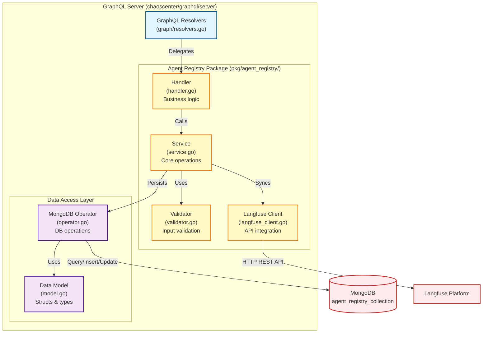
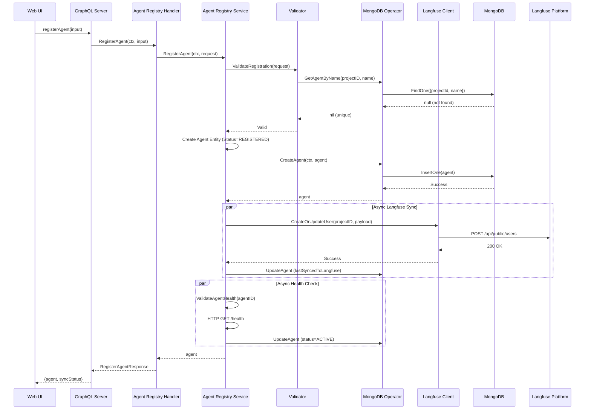
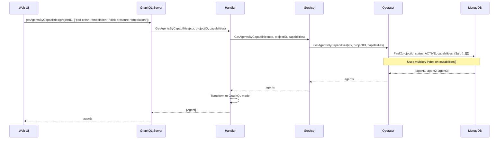
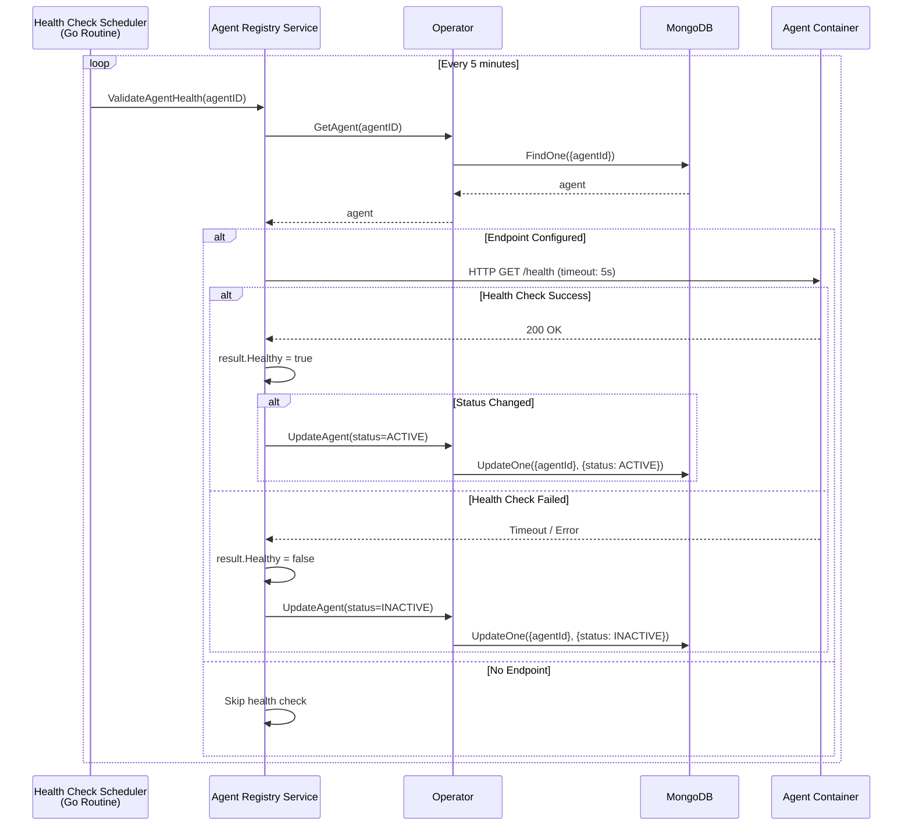

# Feature 1.3: Agent Registry Service
## Design Document

**Document Version**: 1.0

---

## 1. Executive Summary

### 1.1 Purpose
The Agent Registry Service is a core backend component of the AgentCert platform that manages the complete lifecycle of AI agents within the chaos engineering ecosystem. It serves as the authoritative source for agent metadata, capabilities, and operational status while synchronizing critical information with Langfuse for observability.

### 1.2 Scope
This document covers the design of:
- Agent registration and metadata management
- GraphQL API for agent operations
- MongoDB data persistence layer
- Langfuse metadata synchronization
- Agent validation and health monitoring
- Integration with existing LitmusChaos infrastructure

---

## 2. System Context

### 2.1 Position in AgentCert Architecture

The Agent Registry Service operates within the Chaos Control Plane (ChaosCenter) as a new Go package module integrated into the existing GraphQL server.

```
User Layer (Web UI/CLI)
    ↓ GraphQL Operations
Agent Registry Service (pkg/agent_registry/)
    ↓                              ↓
MongoDB (agent_registry_collection)    Langfuse (Metadata Sync)
```

### 2.2 Integration Points

| Component | Relationship | Interface |
|-----------|-------------|-----------|
| **Web UI** | Consumer | GraphQL mutations/queries via Apollo Client |
| **LitmusCtl CLI** | Consumer | GraphQL API via HTTP |
| **GraphQL Server** | Host | Embedded as Go package in graphql/server |
| **MongoDB** | Storage | Native MongoDB driver (existing patterns) |
| **Langfuse** | Observability | HTTP REST API client |
| **Authentication Service** | Dependency | gRPC for user/project validation |
| **Agent Helm Chart** | Deployment Target | Agent metadata informs chart deployment |

### 2.3 Design Constraints

1. **Infrastructure Reuse**: Must leverage existing LitmusChaos patterns (MongoDB operators, GraphQL resolvers, gRPC clients)
2. **No Breaking Changes**: Cannot modify existing GraphQL schema; only extend it
3. **Language**: Go 1.22+ following existing codebase conventions
4. **Database**: MongoDB 5.0+ using existing connection pool
5. **API Style**: GraphQL-first, maintaining consistency with existing LitmusChaos APIs

---

## 3. Functional Requirements

### 3.1 Core Capabilities

#### FR-1: Agent Registration
**Description**: Register new AI agents with comprehensive metadata  
**Input**:
- Agent name (unique within project)
- Version (semantic versioning)
- Vendor/organization
- Capabilities list (fault remediation types)
- Container image (registry URL + tag)
- Kubernetes namespace (for endpoint auto-discovery)
- Endpoint (optional, auto-discovered if not provided)
- Langfuse project ID (optional)

**Output**: Unique agent ID, registration timestamp, initial status, auto-discovered endpoint

**Business Rules**:
- Agent name must be unique within a project scope
- Container image must follow standard format: `registry/repository:tag`
- Capabilities must be from predefined taxonomy (extensible)
- Langfuse project must exist if specified
- Endpoint auto-discovered from Kubernetes Service if not provided (convention: `http://{agent-name}.{namespace}.svc.cluster.local:8080`)
- Agent containers MUST expose `/health` and `/ready` endpoints

#### FR-2: Agent Metadata Management
**Description**: Update and retrieve agent information

**Operations**:
- **Update Agent**: Modify version, capabilities, endpoint, container image, status
- **Get Agent**: Retrieve complete agent record by ID
- **List Agents**: Retrieve all agents with filtering and pagination
- **Delete Agent**: Soft delete (mark as inactive) or hard delete

**Business Rules**:
- Updates preserve audit trail (createdAt, updatedAt timestamps)
- Deletion requires confirmation and checks for active benchmarks
- Status transitions follow defined state machine

#### FR-3: Capability-Based Querying
**Description**: Retrieve agents matching specific fault remediation capabilities

**Input**: List of required capabilities (e.g., ["pod-crash-remediation", "network-latency-handling"])

**Output**: List of agents supporting ALL specified capabilities

**Use Case**: Benchmark scenario selection - "Find all agents capable of handling disk-pressure faults"

#### FR-4: Agent Health Validation
**Description**: Validate agent availability and readiness

**Operations**:
- Health check via HTTP endpoint (`/health`)
- Readiness probe via HTTP endpoint (`/ready`)
- Status update based on validation results
- Automatic retry with exponential backoff

**Status Transitions**:
```
REGISTERED → VALIDATING → ACTIVE
ACTIVE → INACTIVE (failed health checks)
INACTIVE → ACTIVE (health restored)
ACTIVE → DELETED (user-initiated)
```

#### FR-5: Langfuse Metadata Synchronization
**Description**: Sync agent metadata to Langfuse for observability correlation

**Sync Operations**:
- **On Registration**: Create Langfuse user/entity for agent
- **On Update**: Update Langfuse metadata fields
- **On Status Change**: Update agent status in Langfuse
- **On Deletion**: Mark agent as inactive in Langfuse (retain historical data)

**Metadata Synced**:
- Agent ID, name, version
- Capabilities list
- Container image reference
- Registration and update timestamps
- Current operational status

---

## 4. Non-Functional Requirements

### 4.1 Performance
- **Registration Latency**: < 500ms (excluding Langfuse sync)
- **Query Response Time**: < 200ms for list operations (100 agents)
- **Concurrent Operations**: Support 50+ concurrent GraphQL operations
- **Database Queries**: All queries must use indexed fields

### 4.2 Scalability
- **Agent Capacity**: Support 1000+ registered agents per installation
- **Metadata Size**: Handle 100KB+ metadata per agent
- **Query Pagination**: Default 20 items, max 100 items per page

### 4.3 Reliability
- **Availability**: 99.9% uptime (follows GraphQL server availability)
- **Data Durability**: MongoDB replication (existing infrastructure)
- **Graceful Degradation**: Continue operations if Langfuse sync fails
- **Retry Logic**: Exponential backoff for Langfuse API calls

### 4.4 Security
- **Authentication**: JWT-based auth via existing Auth Service
- **Authorization**: Project-level RBAC (agents belong to projects)
- **Input Validation**: Sanitize all user inputs (prevent injection attacks)
- **Secrets Management**: Langfuse API keys stored in Kubernetes Secrets

### 4.5 Observability
- **Structured Logging**: Use logrus with consistent field naming
- **Metrics**: Expose Prometheus metrics (registration count, sync failures, query latency)
- **Tracing**: Optional OpenTelemetry traces for debugging

---

## 5. System Design

### 5.1 Component Architecture



### 5.2 Module Structure

```
chaoscenter/graphql/server/pkg/agent_registry/
├── handler.go              # HTTP/GraphQL handler functions
├── service.go              # Core business logic
├── operator.go             # MongoDB CRUD operations
├── model.go                # Data structures and types
├── validator.go            # Input validation logic
├── langfuse_client.go      # Langfuse API client
├── health_scheduler.go     # Health check scheduler (Go routine)
├── constants.go            # Constants and enums
├── errors.go               # Custom error types
└── agent_registry_test.go  # Unit tests
```

### 5.3 Data Model

#### MongoDB Schema: `agent_registry_collection`

```json
{
  "_id": "ObjectId",
  "agentId": "string (UUID)",
  "projectId": "string (references project_collection)",
  "name": "string",
  "version": "string",
  "vendor": "string",
  "description": "string",
  "capabilities": ["string"],
  "containerImage": {
    "registry": "string",
    "repository": "string",
    "tag": "string"
  },
  "endpoint": {
    "discoveryType": "string (AUTO|MANUAL)",
    "type": "string (REST|gRPC)",
    "url": "string",
    "healthPath": "string",
    "readyPath": "string",
    "namespace": "string",
    "lastDiscovered": "timestamp"
  },
  "langfuseConfig": {
    "projectId": "string",
    "userId": "string (Langfuse user ID)",
    "syncEnabled": "boolean"
  },
  "status": "string (REGISTERED|VALIDATING|ACTIVE|INACTIVE|DELETED)",
  "metadata": {
    "labels": {"key": "value"},
    "annotations": {"key": "value"}
  },
  "auditInfo": {
    "createdBy": "string",
    "createdAt": "timestamp",
    "updatedBy": "string",
    "updatedAt": "timestamp",
    "lastHealthCheck": "timestamp"
  }
}
```

#### Indexes

```javascript
// Unique index on agentId
db.agent_registry_collection.createIndex({ "agentId": 1 }, { unique: true });

// Compound index for project-scoped queries
db.agent_registry_collection.createIndex({ "projectId": 1, "name": 1 }, { unique: true });

// Index for status-based filtering
db.agent_registry_collection.createIndex({ "status": 1, "auditInfo.createdAt": -1 });

// Index for capability-based queries (multikey index)
db.agent_registry_collection.createIndex({ "capabilities": 1 });
```

### 5.4 GraphQL API Schema

```graphql
# Type Definitions
type Agent {
  id: ID!
  agentId: String!
  projectId: String!
  name: String!
  version: String!
  vendor: String
  description: String
  capabilities: [String!]!
  containerImage: ContainerImage!
  endpoint: AgentEndpoint
  langfuseConfig: LangfuseConfig
  status: AgentStatus!
  metadata: AgentMetadata
  auditInfo: AuditInfo!
}

type ContainerImage {
  registry: String!
  repository: String!
  tag: String!
  fullImagePath: String!
}

type AgentEndpoint {
  discoveryType: EndpointDiscoveryType!
  type: EndpointType!
  url: String!
  healthPath: String
  readyPath: String
  namespace: String
  lastDiscovered: String
}

enum EndpointDiscoveryType {
  AUTO
  MANUAL
}

enum EndpointType {
  REST
  GRPC
}

type LangfuseConfig {
  projectId: String!
  userId: String
  syncEnabled: Boolean!
}

enum AgentStatus {
  REGISTERED
  VALIDATING
  ACTIVE
  INACTIVE
  DELETED
}

type AgentMetadata {
  labels: [KeyValuePair!]
  annotations: [KeyValuePair!]
}

type KeyValuePair {
  key: String!
  value: String!
}

type AuditInfo {
  createdBy: String!
  createdAt: String!
  updatedBy: String
  updatedAt: String
  lastHealthCheck: String
}

# Input Types
input RegisterAgentInput {
  projectId: String!
  name: String!
  version: String!
  vendor: String
  description: String
  capabilities: [String!]!
  containerImage: ContainerImageInput!
  namespace: String!  # Kubernetes namespace for auto-discovery
  endpoint: AgentEndpointInput  # Optional: auto-discovered if not provided
  langfuseConfig: LangfuseConfigInput
  metadata: AgentMetadataInput
}

input ContainerImageInput {
  registry: String!
  repository: String!
  tag: String!
}

input AgentEndpointInput {
  discoveryType: EndpointDiscoveryType
  type: EndpointType
  url: String
  healthPath: String
  readyPath: String
}

input LangfuseConfigInput {
  projectId: String!
  syncEnabled: Boolean!
}

input AgentMetadataInput {
  labels: [KeyValuePairInput!]
  annotations: [KeyValuePairInput!]
}

input KeyValuePairInput {
  key: String!
  value: String!
}

input UpdateAgentInput {
  version: String
  description: String
  capabilities: [String!]
  containerImage: ContainerImageInput
  endpoint: AgentEndpointInput
  langfuseConfig: LangfuseConfigInput
  status: AgentStatus
  metadata: AgentMetadataInput
}

input ListAgentsFilter {
  projectId: String
  status: AgentStatus
  capabilities: [String!]
  searchTerm: String
}

input PaginationInput {
  page: Int!
  limit: Int!
}

# Query Operations
type Query {
  """
  Retrieve a single agent by ID
  """
  getAgent(id: ID!): Agent

  """
  List all agents with optional filtering and pagination
  """
  listAgents(
    filter: ListAgentsFilter
    pagination: PaginationInput
  ): AgentListResponse!

  """
  Get agents matching specific capabilities (AND logic)
  """
  getAgentsByCapabilities(
    projectId: String!
    capabilities: [String!]!
  ): [Agent!]!

  """
  Get current status and health of an agent
  """
  getAgentStatus(id: ID!): AgentStatusResponse!

  """
  Get available agent capabilities taxonomy
  """
  getAgentCapabilitiesTaxonomy: [CapabilityDefinition!]!
}

type AgentListResponse {
  agents: [Agent!]!
  totalCount: Int!
  page: Int!
  limit: Int!
  hasNextPage: Boolean!
}

type AgentStatusResponse {
  agentId: String!
  status: AgentStatus!
  healthCheck: HealthCheckResult
  lastSyncedToLangfuse: String
}

type HealthCheckResult {
  healthy: Boolean!
  ready: Boolean!
  message: String
  checkedAt: String!
}

type CapabilityDefinition {
  id: String!
  name: String!
  description: String!
  category: String!
}

# Mutation Operations
type Mutation {
  """
  Register a new agent
  """
  registerAgent(input: RegisterAgentInput!): RegisterAgentResponse!

  """
  Update existing agent metadata
  """
  updateAgent(id: ID!, input: UpdateAgentInput!): Agent!

  """
  Delete an agent (soft delete by default)
  """
  deleteAgent(id: ID!, hardDelete: Boolean): DeleteAgentResponse!

  """
  Manually trigger agent health check
  """
  validateAgentHealth(id: ID!): AgentStatusResponse!

  """
  Manually trigger Langfuse metadata sync
  """
  syncAgentToLangfuse(id: ID!): SyncResponse!
}

type RegisterAgentResponse {
  agent: Agent!
  langfuseSyncStatus: SyncStatus!
}

enum SyncStatus {
  SUCCESS
  FAILED
  SKIPPED
}

type DeleteAgentResponse {
  success: Boolean!
  message: String!
}

type SyncResponse {
  success: Boolean!
  syncedAt: String
  message: String
}
```

---

## 6. Detailed Component Design

### 6.1 Handler Layer (`handler.go`)

**Responsibility**: GraphQL resolver implementation and request/response transformation

```go
package agent_registry

import (
    "context"
    "github.com/litmuschaos/litmus/chaoscenter/graphql/server/graph/model"
)

type Handler struct {
    service Service
}

func NewHandler(service Service) *Handler {
    return &Handler{service: service}
}

// RegisterAgent handles agent registration requests
func (h *Handler) RegisterAgent(ctx context.Context, input model.RegisterAgentInput) (*model.RegisterAgentResponse, error) {
    // 1. Extract user context (project, user ID) from JWT
    // 2. Call service layer
    // 3. Transform service response to GraphQL model
    // 4. Return response
}

// GetAgent retrieves agent by ID
func (h *Handler) GetAgent(ctx context.Context, id string) (*model.Agent, error) {
    // Implementation
}

// ListAgents retrieves agents with filtering/pagination
func (h *Handler) ListAgents(ctx context.Context, filter *model.ListAgentsFilter, pagination *model.PaginationInput) (*model.AgentListResponse, error) {
    // Implementation
}

// UpdateAgent updates agent metadata
func (h *Handler) UpdateAgent(ctx context.Context, id string, input model.UpdateAgentInput) (*model.Agent, error) {
    // Implementation
}

// DeleteAgent soft/hard deletes an agent
func (h *Handler) DeleteAgent(ctx context.Context, id string, hardDelete bool) (*model.DeleteAgentResponse, error) {
    // Implementation
}

// GetAgentsByCapabilities retrieves agents matching capabilities
func (h *Handler) GetAgentsByCapabilities(ctx context.Context, projectID string, capabilities []string) ([]*model.Agent, error) {
    // Implementation
}

// GetAgentStatus checks agent health and status
func (h *Handler) GetAgentStatus(ctx context.Context, id string) (*model.AgentStatusResponse, error) {
    // Implementation
}

// ValidateAgentHealth manually triggers health check
func (h *Handler) ValidateAgentHealth(ctx context.Context, id string) (*model.AgentStatusResponse, error) {
    // Implementation
}

// SyncAgentToLangfuse manually triggers Langfuse sync
func (h *Handler) SyncAgentToLangfuse(ctx context.Context, id string) (*model.SyncResponse, error) {
    // Implementation
}

// GetAgentCapabilitiesTaxonomy returns available capabilities
func (h *Handler) GetAgentCapabilitiesTaxonomy(ctx context.Context) ([]*model.CapabilityDefinition, error) {
    // Implementation
}
```

### 6.2 Service Layer (`service.go`)

**Responsibility**: Core business logic, orchestration, and validation

```go
package agent_registry

import (
    "context"
    "time"
)

type Service interface {
    RegisterAgent(ctx context.Context, req *RegisterAgentRequest) (*Agent, error)
    GetAgent(ctx context.Context, id string) (*Agent, error)
    ListAgents(ctx context.Context, filter *AgentFilter, pagination *Pagination) (*AgentListResult, error)
    UpdateAgent(ctx context.Context, id string, req *UpdateAgentRequest) (*Agent, error)
    DeleteAgent(ctx context.Context, id string, hardDelete bool) error
    GetAgentsByCapabilities(ctx context.Context, projectID string, capabilities []string) ([]*Agent, error)
    ValidateAgentHealth(ctx context.Context, id string) (*HealthCheckResult, error)
    SyncToLangfuse(ctx context.Context, agent *Agent) error
}

type serviceImpl struct {
    operator        Operator
    validator       Validator
    langfuseClient  LangfuseClient
    k8sClient       kubernetes.Interface
    logger          *logrus.Logger
}

func NewService(operator Operator, validator Validator, langfuseClient LangfuseClient, k8sClient kubernetes.Interface, logger *logrus.Logger) Service {
    return &serviceImpl{
        operator:       operator,
        validator:      validator,
        langfuseClient: langfuseClient,
        k8sClient:      k8sClient,
        logger:         logger,
    }
}

// RegisterAgent registers a new agent
func (s *serviceImpl) RegisterAgent(ctx context.Context, req *RegisterAgentRequest) (*Agent, error) {
    // 1. Validate input (name uniqueness, image format, capabilities)
    if err := s.validator.ValidateRegistration(req); err != nil {
        return nil, err
    }
    
    // 2. Auto-discover endpoint if not provided
    endpoint := req.Endpoint
    if endpoint == nil {
        discoveredEndpoint, err := s.discoverAgentEndpoint(ctx, req.Name, req.Namespace)
        if err != nil {
            s.logger.Warnf("Failed to auto-discover endpoint: %v", err)
            // Continue without endpoint - will be discovered during health check
        } else {
            endpoint = discoveredEndpoint
        }
    }
    
    // 3. Create agent entity with REGISTERED status
    agent := &Agent{
        AgentID:    generateUUID(),
        ProjectID:  req.ProjectID,
        Name:       req.Name,
        Version:    req.Version,
        Endpoint:   endpoint,
        Status:     StatusRegistered,
        CreatedAt:  time.Now(),
        // ... populate other fields
    }
    
    // 4. Persist to MongoDB
    if err := s.operator.CreateAgent(ctx, agent); err != nil {
        return nil, err
    }
    
    // 5. Async sync to Langfuse (non-blocking)
    go func() {
        if err := s.SyncToLangfuse(context.Background(), agent); err != nil {
            s.logger.Errorf("Failed to sync agent to Langfuse: %v", err)
        }
    }()
    
    // 6. Trigger health validation (async)
    go func() {
        if _, err := s.ValidateAgentHealth(context.Background(), agent.AgentID); err != nil {
            s.logger.Warnf("Initial health check failed: %v", err)
        }
    }()
    
    return agent, nil
}

// discoverAgentEndpoint auto-discovers agent endpoint from Kubernetes Service
func (s *serviceImpl) discoverAgentEndpoint(ctx context.Context, agentName, namespace string) (*AgentEndpoint, error) {
    // Query Kubernetes API for service
    service, err := s.k8sClient.CoreV1().Services(namespace).Get(ctx, agentName, metav1.GetOptions{})
    if err != nil {
        return nil, fmt.Errorf("failed to get service: %w", err)
    }
    
    // Construct service URL (convention-based)
    serviceURL := fmt.Sprintf("http://%s.%s.svc.cluster.local:8080", agentName, namespace)
    
    return &AgentEndpoint{
        DiscoveryType: "AUTO",
        Type:          "REST",
        URL:           serviceURL,
        HealthPath:    "/health",
        ReadyPath:     "/ready",
        Namespace:     namespace,
        LastDiscovered: time.Now(),
    }, nil
}

// ValidateAgentHealth performs health check
func (s *serviceImpl) ValidateAgentHealth(ctx context.Context, id string) (*HealthCheckResult, error) {
    // 1. Fetch agent from DB
    agent, err := s.operator.GetAgent(ctx, id)
    if err != nil {
        return nil, err
    }
    
    // 2. Skip if no endpoint configured
    if agent.Endpoint == nil {
        return &HealthCheckResult{Healthy: false, Message: "No endpoint configured"}, nil
    }
    
    // 3. HTTP health check with timeout
    result := s.performHealthCheck(agent.Endpoint)
    
    // 4. Update agent status based on result
    newStatus := StatusActive
    if !result.Healthy {
        newStatus = StatusInactive
    }
    
    if agent.Status != newStatus {
        agent.Status = newStatus
        agent.LastHealthCheck = time.Now()
        s.operator.UpdateAgent(ctx, agent)
    }
    
    return result, nil
}

// SyncToLangfuse syncs agent metadata to Langfuse
func (s *serviceImpl) SyncToLangfuse(ctx context.Context, agent *Agent) error {
    if agent.LangfuseConfig == nil || !agent.LangfuseConfig.SyncEnabled {
        return nil
    }
    
    // 1. Prepare Langfuse user payload
    payload := &LangfuseUserPayload{
        ID:       agent.AgentID,
        Name:     agent.Name,
        Metadata: map[string]interface{}{
            "version":      agent.Version,
            "vendor":       agent.Vendor,
            "capabilities": agent.Capabilities,
            "containerImage": agent.ContainerImage.FullImagePath(),
            "status":       agent.Status,
        },
    }
    
    // 2. Call Langfuse API with retry
    if err := s.langfuseClient.CreateOrUpdateUser(ctx, agent.LangfuseConfig.ProjectID, payload); err != nil {
        return err
    }
    
    // 3. Update sync timestamp
    agent.LastSyncedToLangfuse = time.Now()
    return s.operator.UpdateAgent(ctx, agent)
}

// Additional methods...
```

### 6.3 Operator Layer (`operator.go`)

**Responsibility**: MongoDB data access operations

```go
package agent_registry

import (
    "context"
    "go.mongodb.org/mongo-driver/bson"
    "go.mongodb.org/mongo-driver/mongo"
)

const CollectionName = "agent_registry_collection"

type Operator interface {
    CreateAgent(ctx context.Context, agent *Agent) error
    GetAgent(ctx context.Context, id string) (*Agent, error)
    GetAgentByName(ctx context.Context, projectID, name string) (*Agent, error)
    ListAgents(ctx context.Context, filter *AgentFilter, pagination *Pagination) ([]*Agent, int64, error)
    UpdateAgent(ctx context.Context, agent *Agent) error
    DeleteAgent(ctx context.Context, id string) error
    GetAgentsByCapabilities(ctx context.Context, projectID string, capabilities []string) ([]*Agent, error)
}

type operatorImpl struct {
    collection *mongo.Collection
}

func NewOperator(database *mongo.Database) Operator {
    return &operatorImpl{
        collection: database.Collection(CollectionName),
    }
}

// CreateAgent inserts new agent document
func (o *operatorImpl) CreateAgent(ctx context.Context, agent *Agent) error {
    _, err := o.collection.InsertOne(ctx, agent)
    return err
}

// GetAgent retrieves agent by agentId
func (o *operatorImpl) GetAgent(ctx context.Context, id string) (*Agent, error) {
    var agent Agent
    filter := bson.M{"agentId": id, "status": bson.M{"$ne": StatusDeleted}}
    err := o.collection.FindOne(ctx, filter).Decode(&agent)
    if err == mongo.ErrNoDocuments {
        return nil, ErrAgentNotFound
    }
    return &agent, err
}

// GetAgentsByCapabilities retrieves agents with ALL specified capabilities
func (o *operatorImpl) GetAgentsByCapabilities(ctx context.Context, projectID string, capabilities []string) ([]*Agent, error) {
    filter := bson.M{
        "projectId": projectID,
        "status":    StatusActive,
        "capabilities": bson.M{"$all": capabilities}, // MongoDB $all operator
    }
    
    cursor, err := o.collection.Find(ctx, filter)
    if err != nil {
        return nil, err
    }
    defer cursor.Close(ctx)
    
    var agents []*Agent
    if err = cursor.All(ctx, &agents); err != nil {
        return nil, err
    }
    
    return agents, nil
}

// ListAgents retrieves agents with filtering and pagination
func (o *operatorImpl) ListAgents(ctx context.Context, filter *AgentFilter, pagination *Pagination) ([]*Agent, int64, error) {
    // Build filter query
    mongoFilter := bson.M{}
    
    if filter.ProjectID != "" {
        mongoFilter["projectId"] = filter.ProjectID
    }
    
    if filter.Status != "" {
        mongoFilter["status"] = filter.Status
    }
    
    if len(filter.Capabilities) > 0 {
        mongoFilter["capabilities"] = bson.M{"$all": filter.Capabilities}
    }
    
    if filter.SearchTerm != "" {
        mongoFilter["$or"] = []bson.M{
            {"name": bson.M{"$regex": filter.SearchTerm, "$options": "i"}},
            {"vendor": bson.M{"$regex": filter.SearchTerm, "$options": "i"}},
        }
    }
    
    // Count total
    total, err := o.collection.CountDocuments(ctx, mongoFilter)
    if err != nil {
        return nil, 0, err
    }
    
    // Find with pagination
    opts := options.Find().
        SetSkip(int64((pagination.Page - 1) * pagination.Limit)).
        SetLimit(int64(pagination.Limit)).
        SetSort(bson.D{{"auditInfo.createdAt", -1}})
    
    cursor, err := o.collection.Find(ctx, mongoFilter, opts)
    if err != nil {
        return nil, 0, err
    }
    defer cursor.Close(ctx)
    
    var agents []*Agent
    if err = cursor.All(ctx, &agents); err != nil {
        return nil, 0, err
    }
    
    return agents, total, nil
}

// UpdateAgent updates agent document
func (o *operatorImpl) UpdateAgent(ctx context.Context, agent *Agent) error {
    filter := bson.M{"agentId": agent.AgentID}
    update := bson.M{"$set": agent}
    _, err := o.collection.UpdateOne(ctx, filter, update)
    return err
}

// DeleteAgent removes agent (hard delete)
func (o *operatorImpl) DeleteAgent(ctx context.Context, id string) error {
    filter := bson.M{"agentId": id}
    _, err := o.collection.DeleteOne(ctx, filter)
    return err
}
```

### 6.4 Validator Layer (`validator.go`)

**Responsibility**: Input validation and business rule enforcement

```go
package agent_registry

import (
    "fmt"
    "regexp"
    "strings"
)

type Validator interface {
    ValidateRegistration(req *RegisterAgentRequest) error
    ValidateUpdate(req *UpdateAgentRequest) error
    ValidateCapabilities(capabilities []string) error
    ValidateContainerImage(image *ContainerImage) error
}

type validatorImpl struct {
    operator             Operator
    capabilitiesTaxonomy map[string]bool
}

func NewValidator(operator Operator) Validator {
    return &validatorImpl{
        operator:             operator,
        capabilitiesTaxonomy: loadCapabilitiesTaxonomy(),
    }
}

// ValidateRegistration validates registration request
func (v *validatorImpl) ValidateRegistration(req *RegisterAgentRequest) error {
    // Name validation
    if req.Name == "" {
        return fmt.Errorf("agent name is required")
    }
    if !isValidName(req.Name) {
        return fmt.Errorf("agent name must be alphanumeric with hyphens")
    }
    
    // Check uniqueness
    existing, _ := v.operator.GetAgentByName(context.Background(), req.ProjectID, req.Name)
    if existing != nil {
        return fmt.Errorf("agent with name '%s' already exists in project", req.Name)
    }
    
    // Version validation (semantic versioning)
    if !isValidSemver(req.Version) {
        return fmt.Errorf("version must follow semantic versioning (e.g., 1.0.0)")
    }
    
    // Capabilities validation
    if err := v.ValidateCapabilities(req.Capabilities); err != nil {
        return err
    }
    
    // Container image validation
    if err := v.ValidateContainerImage(req.ContainerImage); err != nil {
        return err
    }
    
    return nil
}

// ValidateCapabilities checks against taxonomy
func (v *validatorImpl) ValidateCapabilities(capabilities []string) error {
    if len(capabilities) == 0 {
        return fmt.Errorf("at least one capability is required")
    }
    
    for _, cap := range capabilities {
        if !v.capabilitiesTaxonomy[cap] {
            return fmt.Errorf("invalid capability: %s", cap)
        }
    }
    
    return nil
}

// ValidateContainerImage validates image format
func (v *validatorImpl) ValidateContainerImage(image *ContainerImage) error {
    if image.Registry == "" || image.Repository == "" || image.Tag == "" {
        return fmt.Errorf("container image must have registry, repository, and tag")
    }
    
    // Validate registry format (e.g., docker.io, gcr.io, quay.io)
    if !isValidRegistry(image.Registry) {
        return fmt.Errorf("invalid registry format: %s", image.Registry)
    }
    
    // Validate tag format
    if !isValidTag(image.Tag) {
        return fmt.Errorf("invalid tag format: %s", image.Tag)
    }
    
    return nil
}

// Helper functions
func isValidName(name string) bool {
    pattern := `^[a-z0-9]([-a-z0-9]*[a-z0-9])?$`
    matched, _ := regexp.MatchString(pattern, name)
    return matched
}

func isValidSemver(version string) bool {
    pattern := `^v?(\d+)\.(\d+)\.(\d+)(?:-([a-zA-Z0-9.-]+))?(?:\+([a-zA-Z0-9.-]+))?$`
    matched, _ := regexp.MatchString(pattern, version)
    return matched
}

func isValidRegistry(registry string) bool {
    // Allow common registries and private registries
    return strings.Contains(registry, ".")
}

func isValidTag(tag string) bool {
    // Tags can be version numbers or descriptive tags
    return tag != ""
}

func loadCapabilitiesTaxonomy() map[string]bool {
    // Load from configuration or database
    return map[string]bool{
        "pod-crash-remediation":      true,
        "pod-delete-remediation":     true,
        "network-latency-handling":   true,
        "network-loss-handling":      true,
        "disk-pressure-remediation":  true,
        "memory-pressure-remediation": true,
        "cpu-stress-remediation":     true,
        "container-kill-remediation": true,
        "node-drain-handling":        true,
        "service-disruption-handling": true,
    }
}
```

### 6.5 Langfuse Client (`langfuse_client.go`)

**Responsibility**: Langfuse API integration with retry logic

```go
package agent_registry

import (
    "bytes"
    "context"
    "encoding/json"
    "fmt"
    "net/http"
    "time"
)

type LangfuseClient interface {
    CreateOrUpdateUser(ctx context.Context, projectID string, payload *LangfuseUserPayload) error
    DeleteUser(ctx context.Context, projectID, userID string) error
}

type langfuseClientImpl struct {
    baseURL    string
    apiKey     string
    httpClient *http.Client
}

type LangfuseUserPayload struct {
    ID       string                 `json:"id"`
    Name     string                 `json:"name"`
    Metadata map[string]interface{} `json:"metadata"`
}

func NewLangfuseClient(baseURL, apiKey string) LangfuseClient {
    return &langfuseClientImpl{
        baseURL: baseURL,
        apiKey:  apiKey,
        httpClient: &http.Client{
            Timeout: 10 * time.Second,
        },
    }
}

// CreateOrUpdateUser creates or updates user in Langfuse
func (c *langfuseClientImpl) CreateOrUpdateUser(ctx context.Context, projectID string, payload *LangfuseUserPayload) error {
    url := fmt.Sprintf("%s/api/public/users", c.baseURL)
    
    jsonData, err := json.Marshal(payload)
    if err != nil {
        return err
    }
    
    req, err := http.NewRequestWithContext(ctx, http.MethodPost, url, bytes.NewBuffer(jsonData))
    if err != nil {
        return err
    }
    
    req.Header.Set("Content-Type", "application/json")
    req.Header.Set("Authorization", fmt.Sprintf("Bearer %s", c.apiKey))
    req.Header.Set("X-Langfuse-Project-Id", projectID)
    
    // Retry logic with exponential backoff
    maxRetries := 3
    var lastErr error
    
    for i := 0; i < maxRetries; i++ {
        resp, err := c.httpClient.Do(req)
        if err != nil {
            lastErr = err
            time.Sleep(time.Duration(i+1) * time.Second)
            continue
        }
        defer resp.Body.Close()
        
        if resp.StatusCode >= 200 && resp.StatusCode < 300 {
            return nil
        }
        
        lastErr = fmt.Errorf("langfuse API returned status %d", resp.StatusCode)
        
        if resp.StatusCode >= 500 {
            // Retry on server errors
            time.Sleep(time.Duration(i+1) * time.Second)
            continue
        }
        
        // Don't retry on client errors
        break
    }
    
    return lastErr
}

// DeleteUser marks user as inactive in Langfuse
func (c *langfuseClientImpl) DeleteUser(ctx context.Context, projectID, userID string) error {
    // Langfuse doesn't delete users, so we update metadata
    payload := &LangfuseUserPayload{
        ID: userID,
        Metadata: map[string]interface{}{
            "status": "deleted",
        },
    }
    
    return c.CreateOrUpdateUser(ctx, projectID, payload)
}
```

### 6.6 Health Check Scheduler (`health_scheduler.go`)

**Responsibility**: Periodic health check execution for all active agents

```go
package agent_registry

import (
    "context"
    "time"
    "github.com/sirupsen/logrus"
)

// HealthCheckScheduler periodically validates health of all active agents
type HealthCheckScheduler struct {
    service  Service
    interval time.Duration
    stopChan chan struct{}
    logger   *logrus.Logger
}

func NewHealthCheckScheduler(service Service, interval time.Duration, logger *logrus.Logger) *HealthCheckScheduler {
    return &HealthCheckScheduler{
        service:  service,
        interval: interval,
        stopChan: make(chan struct{}),
        logger:   logger,
    }
}

// Start begins the health check scheduling loop
func (s *HealthCheckScheduler) Start(ctx context.Context) {
    s.logger.Infof("Starting health check scheduler with interval: %v", s.interval)
    
    ticker := time.NewTicker(s.interval)
    defer ticker.Stop()
    
    // Run initial health check
    s.runHealthChecks(ctx)
    
    for {
        select {
        case <-ticker.C:
            s.runHealthChecks(ctx)
        case <-s.stopChan:
            s.logger.Info("Stopping health check scheduler")
            return
        case <-ctx.Done():
            s.logger.Info("Context cancelled, stopping health check scheduler")
            return
        }
    }
}

// Stop gracefully stops the scheduler
func (s *HealthCheckScheduler) Stop() {
    close(s.stopChan)
}

// runHealthChecks validates health of all active agents
func (s *HealthCheckScheduler) runHealthChecks(ctx context.Context) {
    s.logger.Debug("Running health checks for all active agents")
    
    // Fetch all active agents
    filter := &AgentFilter{
        Status: StatusActive,
    }
    
    result, err := s.service.ListAgents(ctx, filter, nil)
    if err != nil {
        s.logger.Errorf("Failed to list agents for health check: %v", err)
        return
    }
    
    s.logger.Infof("Running health checks for %d active agents", len(result.Agents))
    
    // Validate each agent concurrently
    for _, agent := range result.Agents {
        // Run in goroutine to avoid blocking
        go func(agentID string) {
            checkCtx, cancel := context.WithTimeout(ctx, 30*time.Second)
            defer cancel()
            
            result, err := s.service.ValidateAgentHealth(checkCtx, agentID)
            if err != nil {
                s.logger.Warnf("Health check failed for agent %s: %v", agentID, err)
                return
            }
            
            if !result.Healthy {
                s.logger.Warnf("Agent %s is unhealthy: %s", agentID, result.Message)
            } else {
                s.logger.Debugf("Agent %s health check passed", agentID)
            }
        }(agent.AgentID)
    }
}
```

---

## 7. API Workflows

### 7.1 Agent Registration Flow



### 7.2 Capability-Based Query Flow



### 7.3 Health Check Flow



---

## 8. Error Handling

### 8.1 Error Types

```go
// errors.go
package agent_registry

import "errors"

var (
    // Not Found Errors
    ErrAgentNotFound = errors.New("agent not found")
    ErrProjectNotFound = errors.New("project not found")
    
    // Validation Errors
    ErrInvalidAgentName = errors.New("invalid agent name format")
    ErrDuplicateAgentName = errors.New("agent name already exists in project")
    ErrInvalidVersion = errors.New("invalid semantic version format")
    ErrInvalidCapability = errors.New("invalid capability")
    ErrInvalidContainerImage = errors.New("invalid container image format")
    
    // Operation Errors
    ErrAgentHasActiveRuns = errors.New("cannot delete agent with active benchmark runs")
    ErrHealthCheckFailed = errors.New("agent health check failed")
    ErrLangfuseSyncFailed = errors.New("failed to sync agent to Langfuse")
    
    // Authorization Errors
    ErrUnauthorized = errors.New("unauthorized to access agent")
    ErrInsufficientPermissions = errors.New("insufficient permissions for operation")
)
```

### 8.2 Error Response Mapping

| Error Type | HTTP Status | GraphQL Error Code | User Message |
|-----------|-------------|-------------------|--------------|
| `ErrAgentNotFound` | 404 | `AGENT_NOT_FOUND` | "The requested agent does not exist" |
| `ErrDuplicateAgentName` | 409 | `DUPLICATE_AGENT` | "An agent with this name already exists" |
| `ErrInvalidAgentName` | 400 | `INVALID_INPUT` | "Agent name must be alphanumeric with hyphens" |
| `ErrLangfuseSyncFailed` | 500 | `EXTERNAL_SERVICE_ERROR` | "Failed to sync with observability platform" |
| `ErrUnauthorized` | 403 | `FORBIDDEN` | "You do not have access to this agent" |

### 8.3 Error Handling Strategy

1. **Validation Errors**: Return immediately with descriptive error message
2. **Database Errors**: Log error, return generic error to user
3. **Langfuse Sync Errors**: Log error, continue operation (non-blocking)
4. **Health Check Errors**: Update agent status, log warning
5. **Authorization Errors**: Return 403 with minimal information

---

## 9. Security Considerations

### 9.1 Authentication & Authorization

**Authentication**:
- All GraphQL requests must include valid JWT token
- Token validated by existing Auth Service (gRPC)
- User identity extracted from JWT claims

**Authorization** (RBAC):
- Agents are scoped to projects
- Users must have `PROJECT_MEMBER` role to view agents
- Users must have `PROJECT_OWNER` or `PROJECT_ADMIN` role to register/update/delete agents
- Authorization checks performed in Handler layer before delegating to Service

### 9.2 Input Validation & Sanitization

**Validation Rules**:
- Agent name: Max 63 characters, alphanumeric with hyphens, no spaces
- Version: Must follow semantic versioning
- Container image: Valid registry/repository/tag format
- Capabilities: Must match predefined taxonomy
- Endpoints: Valid URL format with supported protocols (HTTP/HTTPS/gRPC)

**Sanitization**:
- Remove leading/trailing whitespace from all string inputs
- Convert agent names to lowercase
- Validate URLs against SSRF attacks (no localhost, private IPs)

### 9.3 Secrets Management

**Langfuse API Keys**:
- Stored in Kubernetes Secret: `langfuse-api-keys`
- Mounted as environment variable in GraphQL server pod
- Never exposed in GraphQL responses
- Rotated every 90 days

**Agent Credentials**:
- Agent service account tokens managed by Kubernetes
- Tool authentication tokens stored in agent-specific Secrets
- No passwords stored in MongoDB

### 9.4 Rate Limiting

**API Rate Limits**:
- 100 requests per minute per user for mutation operations
- 500 requests per minute per user for query operations
- Rate limiting enforced at GraphQL middleware level

---

## 10. Testing Strategy

### 10.1 Unit Tests

**Target Coverage**: 85%+

**Test Files**:
```
agent_registry_test.go
service_test.go
operator_test.go
validator_test.go
langfuse_client_test.go
```

**Test Cases**:

**Service Layer**:
- `TestRegisterAgent_Success`: Valid agent registration
- `TestRegisterAgent_DuplicateName`: Duplicate agent name error
- `TestRegisterAgent_InvalidCapabilities`: Invalid capability validation
- `TestListAgents_WithFilters`: Filtered agent retrieval
- `TestGetAgentsByCapabilities_ANDLogic`: Capability matching logic
- `TestValidateAgentHealth_Success`: Successful health check
- `TestValidateAgentHealth_Timeout`: Health check timeout handling
- `TestSyncToLangfuse_Success`: Successful Langfuse sync
- `TestSyncToLangfuse_Retry`: Retry logic on failure

**Operator Layer**:
- `TestCreateAgent_Success`: Insert operation
- `TestGetAgent_NotFound`: Not found handling
- `TestListAgents_Pagination`: Pagination logic
- `TestUpdateAgent_Optimistic`: Concurrent update handling

**Validator Layer**:
- `TestValidateName_Valid`: Valid name formats
- `TestValidateName_Invalid`: Invalid name rejection
- `TestValidateSemver`: Version validation
- `TestValidateCapabilities`: Capability taxonomy validation

### 10.2 Integration Tests

**Test Scenarios**:
1. **E2E Registration Flow**: UI → GraphQL → MongoDB → Langfuse
2. **Concurrent Registration**: Multiple agents registered simultaneously
3. **Health Check Cycle**: Agent health status transitions
4. **Langfuse Sync Failure**: Graceful degradation when Langfuse unavailable
5. **Database Connection Loss**: Retry and recovery behavior

**Test Environment**:
- Docker Compose with MongoDB and mock Langfuse API
- TestContainers for isolated integration tests

### 10.3 Performance Tests

**Load Test Scenarios**:
1. **Registration Load**: 100 agents registered in 1 minute
2. **Query Load**: 1000 listAgents queries per minute
3. **Capability Query**: Response time with 1000+ agents
4. **Concurrent Health Checks**: 50 agents checked simultaneously

**Performance Targets**:
- Registration: < 500ms (p95)
- List Agents: < 200ms (p95) for 100 agents
- Capability Query: < 300ms (p95) for 1000 agents
- Memory Usage: < 100MB for service process

---

## 11. Monitoring & Observability

### 11.1 Metrics (Prometheus)

**Metric Definitions**:

```go
// Registration metrics
agent_registry_registrations_total counter
agent_registry_registration_duration_seconds histogram

// Query metrics
agent_registry_queries_total{operation="list|get|getByCapabilities"} counter
agent_registry_query_duration_seconds{operation} histogram

// Health check metrics
agent_registry_health_checks_total{status="success|failed"} counter
agent_registry_health_check_duration_seconds histogram
agent_registry_active_agents gauge
agent_registry_inactive_agents gauge

// Langfuse sync metrics
agent_registry_langfuse_sync_total{status="success|failed"} counter
agent_registry_langfuse_sync_duration_seconds histogram

// Error metrics
agent_registry_errors_total{error_type} counter
```

**Metric Exposition**:
- Metrics exposed at `/metrics` endpoint
- Scraped by existing Prometheus instance
- Retention: 30 days

### 11.2 Logging

**Log Levels**:
- `INFO`: Successful operations (registration, updates, deletions)
- `WARN`: Failed health checks, Langfuse sync retries
- `ERROR`: Database errors, validation failures, unrecoverable errors
- `DEBUG`: Detailed operation traces (development only)

**Structured Log Fields**:
```json
{
  "timestamp": "2026-01-06T10:30:00Z",
  "level": "INFO",
  "operation": "RegisterAgent",
  "agentId": "abc123",
  "agentName": "my-agent",
  "projectId": "proj456",
  "userId": "user789",
  "duration_ms": 245,
  "status": "success"
}
```

**Log Aggregation**:
- Logs sent to existing log aggregation system (e.g., Loki, Elasticsearch)
- Queryable via Grafana dashboards

### 11.3 Distributed Tracing

**OpenTelemetry Traces** (Optional):
- Trace registration flow: GraphQL → Handler → Service → Operator → MongoDB
- Trace Langfuse sync operations
- Span attributes: agentId, projectId, operation, duration
- Trace sampling: 10% of requests

---

## 12. Deployment

### 12.1 Deployment Model

**Integration into Existing GraphQL Server**:
- Agent Registry deployed as Go package within `chaoscenter/graphql/server`
- No separate service deployment required
- Shares existing GraphQL server container

**Configuration**:
```yaml
# Environment variables in GraphQL server deployment
LANGFUSE_BASE_URL: "https://cloud.langfuse.com"
LANGFUSE_API_KEY: "<from-secret>"
AGENT_HEALTH_CHECK_INTERVAL: "5m"  # Health check scheduler interval
AGENT_HEALTH_CHECK_TIMEOUT: "5s"   # Individual health check timeout
CAPABILITY_TAXONOMY_URL: "https://chaos-hub.io/capabilities.json"
```

**Health Check Scheduler Initialization**:
```go
// chaoscenter/graphql/server/main.go
func main() {
    // ... existing setup (MongoDB, GraphQL, etc.)
    
    // Initialize Agent Registry Service
    agentRegistryService := agent_registry.NewService(
        agentRegistryOperator,
        agentRegistryValidator,
        langfuseClient,
        kubernetesClient,  // For endpoint auto-discovery
        logger,
    )
    
    // Start health check scheduler (in-process Go routine)
    healthCheckInterval := getEnvDuration("AGENT_HEALTH_CHECK_INTERVAL", 5*time.Minute)
    healthCheckScheduler := agent_registry.NewHealthCheckScheduler(
        agentRegistryService,
        healthCheckInterval,
        logger,
    )
    
    // Start scheduler in background
    go healthCheckScheduler.Start(context.Background())
    
    // Ensure graceful shutdown
    defer healthCheckScheduler.Stop()
    
    // ... start GraphQL server
}
```

### 12.2 Database Migration

**MongoDB Migration Script** (`migrations/001_create_agent_registry.js`):
```javascript
// Create collection
db.createCollection("agent_registry_collection");

// Create indexes
db.agent_registry_collection.createIndex({ "agentId": 1 }, { unique: true });
db.agent_registry_collection.createIndex({ "projectId": 1, "name": 1 }, { unique: true });
db.agent_registry_collection.createIndex({ "status": 1, "auditInfo.createdAt": -1 });
db.agent_registry_collection.createIndex({ "capabilities": 1 });

// Insert capability taxonomy (optional)
db.capability_taxonomy.insertMany([
  { id: "pod-crash-remediation", name: "Pod Crash Remediation", category: "pod-faults" },
  { id: "network-latency-handling", name: "Network Latency Handling", category: "network-faults" },
  // ... more capabilities
]);
```

**Migration Execution**:
- Run migration as Kubernetes Job before GraphQL server starts
- Use existing LitmusChaos migration framework

---

## 13. Dependencies

### 13.1 Internal Dependencies

| Component | Version | Purpose |
|-----------|---------|---------|
| `chaoscenter/graphql/server` | Existing | Host application |
| `chaoscenter/authentication` | Existing | User authentication |
| `MongoDB` | 5.0+ | Data persistence |
| `logrus` | v1.9+ | Structured logging |
| `gqlgen` | v0.17+ | GraphQL schema generation |

### 13.2 External Dependencies

| Component | Type | Purpose |
|-----------|------|---------|
| **Langfuse** | SaaS/Self-Hosted | Agent observability platform |
| **Kubernetes** | Infrastructure | Agent deployment platform |
| **Helm** | Tool | Agent deployment via Agent Helm Chart |

### 13.3 Go Module Dependencies

```go
// go.mod additions
require (
    github.com/google/uuid v1.3.0           // UUID generation
    go.mongodb.org/mongo-driver v1.12.0     // MongoDB client
    github.com/sirupsen/logrus v1.9.0       // Logging
    github.com/99designs/gqlgen v0.17.20    // GraphQL
    github.com/stretchr/testify v1.8.4      // Testing
    k8s.io/client-go v0.28.0                // Kubernetes client (for endpoint auto-discovery)
    k8s.io/api v0.28.0                      // Kubernetes API types
    k8s.io/apimachinery v0.28.0             // Kubernetes API machinery
)
```

---

## 14. Appendix

### 14.1 Sample API Calls

**Register Agent**:
```graphql
mutation RegisterAgent {
  registerAgent(input: {
    projectId: "proj-123"
    name: "my-chaos-agent"
    version: "1.0.0"
    vendor: "MyCompany"
    description: "AI agent for Kubernetes fault remediation"
    namespace: "default"  # Kubernetes namespace for auto-discovery
    capabilities: [
      "pod-crash-remediation",
      "network-latency-handling",
      "disk-pressure-remediation"
    ]
    containerImage: {
      registry: "docker.io"
      repository: "mycompany/chaos-agent"
      tag: "v1.0.0"
    }
    # endpoint is optional - will be auto-discovered from Kubernetes Service
    # endpoint: {
    #   discoveryType: MANUAL
    #   type: REST
    #   url: "http://my-chaos-agent.default.svc.cluster.local:8080"
    #   healthPath: "/health"
    #   readyPath: "/ready"
    # }
    langfuseConfig: {
      projectId: "agentcert-prod"
      syncEnabled: true
    }
  }) {
    agent {
      id
      agentId
      name
      status
      createdAt
    }
    langfuseSyncStatus
  }
}
```

**List Agents with Filtering**:
```graphql
query ListAgents {
  listAgents(
    filter: {
      projectId: "proj-123"
      status: ACTIVE
      capabilities: ["pod-crash-remediation"]
    }
    pagination: {
      page: 1
      limit: 20
    }
  ) {
    agents {
      id
      name
      version
      capabilities
      status
      containerImage {
        fullImagePath
      }
    }
    totalCount
    hasNextPage
  }
}
```

**Get Agents by Capabilities**:
```graphql
query GetAgentsByCapabilities {
  getAgentsByCapabilities(
    projectId: "proj-123"
    capabilities: ["pod-crash-remediation", "disk-pressure-remediation"]
  ) {
    id
    name
    version
    capabilities
    status
  }
}
```

### 14.2 Capability Taxonomy (Initial Set)

| Capability ID | Display Name | Category | Description |
|--------------|--------------|----------|-------------|
| `pod-crash-remediation` | Pod Crash Remediation | Pod Faults | Detect and remediate pod crashes |
| `pod-delete-remediation` | Pod Delete Remediation | Pod Faults | Handle pod deletion scenarios |
| `network-latency-handling` | Network Latency Handling | Network Faults | Remediate network latency issues |
| `network-loss-handling` | Network Loss Handling | Network Faults | Handle packet loss scenarios |
| `disk-pressure-remediation` | Disk Pressure Remediation | Resource Faults | Remediate disk space exhaustion |
| `memory-pressure-remediation` | Memory Pressure Remediation | Resource Faults | Handle memory exhaustion |
| `cpu-stress-remediation` | CPU Stress Remediation | Resource Faults | Remediate CPU saturation |
| `container-kill-remediation` | Container Kill Remediation | Container Faults | Handle container kill events |
| `node-drain-handling` | Node Drain Handling | Node Faults | Manage node drain scenarios |
| `service-disruption-handling` | Service Disruption Handling | Service Faults | Remediate service unavailability |
